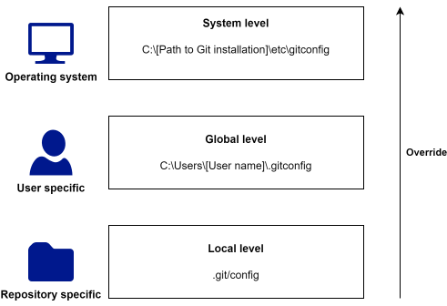

# Configuration of Git {#sec-configuration-of-git}

Section @sec-basic-git-configuration-of-git briefly explained about how to do some basic configuration of Git using `git config`. This appendix will go more in-depth with how Git can be configurated using configuration files.

Git configuration files are simple text files with key-value pairs defining specific options, separated into sections enclosed in square brackets. A simple Git configuration file could look something like shown below:

```{=html}
<div class="notepad-file">
<div class="notepad-header">.gitconfig</div>
<div class="notepad-body">
[user]<br>
&#160&#160&#160&#160name = Your Name<br>
&#160&#160&#160&#160email = your.email@example.com<br>
[core]<br>
&#160&#160&#160&#160editor = notepad<br>
</div>
</div>
```

The name of an option is the section and key separated by a dot, for example `user.name`.


## Git configuration file hierarchy

<div style="display:flex">
<div style="flex:50%;margin-right:1em;">
Git has several levels of configuration files that can be used to customize how Git looks and works. Simplifying things a bit, there are three levels of configurations files: system, global, and local. Configuration settings at each narrower level overwrites settings from the more broader configuration files, i.e. local settings overwrites global settings, and global settings overwrite system settings.
</div>
<div style="margin:1em;">

</div>
</div>

### System level

System level configurations applies to your entire system, ie your entire computer. The system level configuration file is located in a subfolder of your Git installation, for example at `C:\Program Files\Git\etc\gitconfig`. You need admin privileges on your computer to edit this file.

Nowadays most people work on their own computer that they do not share with others, and in this case it is probably most appropriate to not change anything in the system level configuration file, but instead configure Git at the global level. An example of where you might want to make changes to the system level configuration file, is if you have Git installed on a server with multiple users. In that case, maybe you want to tweak the default behaviour of Git for all the users, eg by setting the default text editor Git uses.


### Global level

Global level configurations applies to you as a user. Configuration at this level applies to all your Git repositories, and overwrites configurations set at the system level. The global level configuration file is located in your home directory at `C:\Users\[User name]\.gitconfig`.

This is the level at which you should configure your username, email address, aliases etc, that you want to use across all your Git repositories.

You can see what configurations are contained in your global level configuration file by running the following command in the terminal:


### Local level

Local level configurations applies only to to the Git repository the configuration file is in, and overwrites configurations set at the global level. The local level configuration file can be found in `\.git\config` of a Git repository.

As with the system level configuration file, you usually don't manually change the local level configuration file. An example of where local level configuration can be useful, is if you want to have different email addresses associated with your identity depending on the project you are working on. You might have configured your global configuration file to use your work email, which you use the majority of the time, but you might also work on a personal project, where you want to use your private email. In this case you could simply configure the local configuration file in the personal project to use your private email. 


## Working with configuration files

Git comes with a number of `git config` commands that can be used to read and set options in the configuration files. Here we will talk about basic use of the `git config list`, `git config get`, `git config set`, and `git config edit` commands together with the `--system`, `--global`, and `--local` options to list/get/set/edit option in specific configuration files.

To list all options and their values in a config file you can use the the `git config list` command. If, for example, we wanted to list all global options we could use `git config list --global` which would give us something like

<pre class="git-command">
user.name=Your name
use.email=your@email.com
</pre>

If we want to get the value of a specific option, we can use the `git config get` command. For example if we want the value of the user.name option in the global configuration file we could write `git config get --global user.name`.

To set a specific option, we can use the `git config set` command. For example, if we wanted to set the core.editor option to "notepad" in the system level configuration file we could use the `git config set --system core.editor notepad` command.

Finally, if we want to make changes to a configuration file, we might want
to simply open the configuration file, and edit it by hand. This can be done with the `git config edit` command. For example if we wanted to manually edit the local level configuration file, we could do `git config edit` command, which will open the configuration file in a text editor. We did not add the `--local` option here to illustrate, that by default, many of the `git config` commands defaults to using the `--local` flag.


## Configuration options of interest.

There are A LOT of things that can be configured in Git. Here we briefly highlight a short list of options that are often of interest


### core.editor

Specify what text editor Git should launch to edit text, eg when writing commmit messages. Git for Windows comes with an internal version of Vim that is used by default. If you do not know what Vim is, this is most certainly not the text editor you want Git to use. Notepad is pre-installed on all modern Windows operating systems, and you should be able to change the default text editor to Notepad across all your Git repositories by using the following command:

<pre class="git-command">
git config set --global core.editor notepad
</pre>

This command assumes that the notepad executable can be found in directories given in $PATH. If for some reason the above does not work, locate the Notepad executable manually, and specify the full path to executable instead. This could look something like the below:

<pre class="git-command">
git config set --global core.editor "C:\Windows\System32\notepad.exe"
</pre>


### commit.template

The commit.template option can be used to specify a pathname to a file that is used as the template for new commit messages. A simple commit template with useful advice on how to write a good commit message could be the following text^[Taken from <a href="https://gist.github.com/lisawolderiksen/a7b99d94c92c6671181611be1641c733">https://gist.github.com/lisawolderiksen/a7b99d94c92c6671181611be1641c733</a>], saved in a file we name something like .git-commit-template:

```{=html}
<div class="notepad-file">
<div class="notepad-header">.git-commit-template</div>
<div class="notepad-body">
<pre>
# Title: Summary, imperative, start upper case, don't end with a period
# No more than 50 chars. #### 50 chars is here:  #

# Remember blank line between title and body.

# Body: Explain *what* and *why* (not *how*).
# Wrap at 72 chars. ################################## which is here:  #

# How to Write a Git Commit Message:
# https://chris.beams.io/posts/git-commit/
# 1. Separate subject from body with a blank line
# 2. Limit the subject line to 50 characters
# 3. Capitalize the subject line
# 4. Do not end the subject line with a period
# 5. Use the imperative mood in the subject line
# 6. Wrap the body at 72 characters
# 7. Use the body to explain what and why vs. how
</pre>
</div>
</div>
```

To use this file as a template for commit messages, we could save file
in the home directory, and tell git to use the template for all our Git reposities with the commmand `git config set --global commit.template ~/.git-commit-template`.

### user.email and user.name

The user.name and user.email variables determines what ends up in the author field of commit objects. You should set these options with your name and email so it is clear from the commit object who made the commit.


## Aliases

Git aliases can be used to create shorter commands that map to longer commands. Aliases can be a great help to make it easier to use commands that you find yourself using often, but that are hard to remember and/or are tedious to type out. As a contrived example, consider the `git status` command. You will type that command a lot. Git doesn't automatically infer your command if you type it in partially, but you could setup an alias so that you would only have to type `git st` if you don't want to type the whole command each time:

<pre class="git-command">
git config set --global alias.st status
</pre>

As a more meaningful example consider the `git log` command. One of the biggest shortcomings of using Git from the terminal is the lack of a nice visualization of your commit history that comes with GUI's. Git users often find themselves using some variation of the following command to get a visualization of the commit history of a project in the terminal:

<pre class="git-command">
git log --graph --oneline --all
</pre>

This is tedious to type out, and it can be difficult to remember all the options you need to add. Instead one could make an elegant alias:

<pre class= "git-command">
git config set --global alias.history "log --graph --oneline --all"
</pre>

Now you can just use `git history` instead (or choose any other name that is meaningful to you that is not already used by Git).