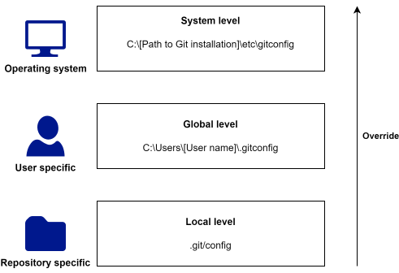

# Configuration of Git {#sec-configuration-of-git}

Section @sec-basic-git-configuration-of-git briefly explained about how to do some basic configuration of Git using `git config`. This appendix will go into more detail about how Git can be configurated using configuration files.

Git configuration files are simple text files named `.gitignore` with key-value pairs defining specific options, separated into sections enclosed in square brackets. A simple Git configuration file could look something like shown below:

```{=html}
<div class="notepad-file">
<div class="notepad-header">.gitconfig</div>
<div class="notepad-body">
[user]<br>
&#160&#160&#160&#160name = Your Name<br>
&#160&#160&#160&#160email = your@email.com<br>
[core]<br>
&#160&#160&#160&#160editor = notepad<br>
</div>
</div>
```

The name of an option is the section and key separated by a dot, for example `user.name`.


## Git configuration file hierarchy

<div style="display:flex">
<div style="flex:50%;margin-right:1em;">
Git has several levels of configuration files that can be used to customize how Git looks and works. Simplifying things a bit, there are three levels of configurations files: system, global, and local. Configuration settings at each narrower level overwrites settings from the more broader configuration files, i.e. local settings overwrites global settings, and global settings overwrite system settings.
</div>
<div style="margin:1em;">

</div>
</div>

### System level

System level configurations applies to all Git repositories on the entire system, i.e. all repositories for all users on the system. The system level configuration file is located in a subfolder of the Git installation, for example at `C:\Program Files\Git\etc\gitconfig`. You need admin privileges to edit this file.

You typically use system level configurations to configure Git for all users on a server. For example, if you wanted to set the default text editor Git uses for all users on the server to be Notepad, this is the place you would do that.


### Global level

Global level configurations applies to all Git repositories of a user. Configuration at this level overwrites configurations set at the system level. The global level configuration file is located in your home directory at `C:\Users\user-id\.gitconfig`.

This is the level at which you should configure your username, email address, aliases etc, that you want to use across all your Git repositories. This would affect all *your* repositories, but not other user's repositories on the same system.


### Local level

Local level configurations applies only to to the Git repository the configuration file is in, and overwrites configurations set at the global level. The local level configuration file can be found in `\.git\config` directory of a Git repository.

Local level configurations are often used to overwrite configurations set at the global level. Forexample, if you are using Git on your work computer, you would probably set `.user.email` to your work email. But if you also worked on a personal Git project on the same system, you could use the local level configuration file to set `user.email` to your private email in this specific project.


## Working with configuration files

Git has a number of `git config` subcommands that can be used to read and set options in a configuration file, some of which we will discuss here. For each command the `--system`, `--global`, and `--local` flags can be used to specify which configuration file to consider. Note that you can only use the `--local` flag if you current working directory is a Git project.


### List options and their values

To list all options and their values from all configuration files you can use `git config list`. If we only want to list all global options and their values we could use `git config list --global` which might return something like:

<pre class="terminal">
$ git config list --global
user.name=Your name
use.email=your@email.com
</pre>


### Get the value of an option

If we want to get the value of a specific option, we can use the `git config get` command. If an option is set in multiple configuration files, the value from the configuration file that takes presedent is shown.

If we wanted to get the value of the `user.name` option in the global configuration file, we could use the following command:

<pre class="terminal">
$ git config get --global user.name
Your name
</pre>

If the option is not set in the specified configuration file, Git simply returns an empty string.


### Set the value of an option

To set a specific option, you can use the `git config set` command.

For example, if we wanted to set the user.email option to "private@email.com" in the local level configuration file we could use the following command:

<pre class="terminal">
$ git config set user.email=private@email.com
</pre>

Note that we did not use a `--local` flag here, since by default the option will be set in the lcoal configuration file.


### Edit a configuration file

Finally, if we want to make changes to a configuration file manually, we can use the `git config edit` command. This will open the specified configuration file in a text-editor. Again, by default this would be the local level configuratin file if no flag is specified.


## Configuration options of interest.

There are A LOT of things that can be configured in Git. Here we briefly highlight a short list of options that are often of interest.


### core.editor

Specify what text editor Git uses by default. Git for Windows comes with a Vim installation that is used by by Git as the default text editor. If you want to use another text-editor by default, for example Notepad, which is pre-installed on all modern Windows systems, use the following command: 

<pre class="terminal">
git config set --global core.editor notepad
</pre>

Bash should be able to locate your notepad executable, but if you later have problems when Git prompts you to use a text editor, try using the full path to the Notepad executable instead. This could look something like this:

<pre class="terminal">
$ git config set --global core.editor "/c/Windows/System32/notepad.exe"
</pre>

### commit.template

The commit.template option can be used to specify a pathname to a file that is used as the template for commit messages. A simple commit template with useful advice on how to write a good commit message could be the following text^[Taken from <a href="https://gist.github.com/lisawolderiksen/a7b99d94c92c6671181611be1641c733">https://gist.github.com/lisawolderiksen/a7b99d94c92c6671181611be1641c733</a>], saved in a file we name something like .git-commit-template:

```{=html}
<div class="notepad-file">
<div class="notepad-header">.git-commit-template</div>
<div class="notepad-body">
<pre>
# Title: Summary, imperative, start upper case, don't end with a period
# No more than 50 chars. #### 50 chars is here:  #

# Remember blank line between title and body.

# Body: Explain *what* and *why* (not *how*).
# Wrap at 72 chars. ################################## which is here:  #

# How to Write a Git Commit Message:
# https://chris.beams.io/posts/git-commit/
# 1. Separate subject from body with a blank line
# 2. Limit the subject line to 50 characters
# 3. Capitalize the subject line
# 4. Do not end the subject line with a period
# 5. Use the imperative mood in the subject line
# 6. Wrap the body at 72 characters
# 7. Use the body to explain what and why vs. how
</pre>
</div>
</div>
```

To use this file as a template for commit messages, we could save file
in the home directory, and tell git to use the template for all our Git reposities with the commmand

<pre class="terminal">
$ git config set --global commit.template ~/.git-commit-template
</pre>


### user.email and user.name

The user.name and user.email variables determines what ends up in the author field of commit objects. You should set these options with your name and email so it is clear from the commit object who made the commit.


## Aliases

Git aliases can be used to create shorter commands that map to longer commands. Aliases can be a great help to make it easier to use commands that you find yourself using often, but that are hard to remember and/or are tedious to type out. As a contrived example, consider the `git status` command. You will type that command a lot. Git doesn't automatically infer your command if you type it in partially, but you could setup an alias so that you would only have to type `git st` if you don't want to type the whole command each time:

<pre class="terminal">
$ git config set --global alias.st status
</pre>

As a more meaningful example consider the `git log` command. One of the biggest shortcomings of using Git from the terminal is the lack of a nice visualization of your commit history that comes with GUI's. Git users often find themselves using some variation of the following command to get a visualization of the commit history of a project in the terminal:

<pre class="terminal">
$ git log --graph --oneline --all
</pre>

This is tedious to type out, and it can be difficult to remember all the options you need to add. Instead one could make an elegant alias:

<pre class= "terminal">
$ git config set --global alias.graph "log --graph --oneline --all"
</pre>

Now you can just use `git graph` instead (or choose any other name that is meaningful to you that is not already used by Git).


## Exercises

### Exercise 1 - Project-specific configurations

Imagine you are about to start a project on a server. The administrators of the server have set the `core.editor` to `notepad` in the system-level configuratino file. Furthermore, you have yourself set the `user.name` and `user.email` option in the global-level configuration file. In this specific project you want to use Vim as the default text-editor, and you want to user another email address. the goal of this exercise is to configure the local-level configuration file to achieve this.

<b>1. Set up the project.</b>

Create a directory named `ex01-git-config` in your home directory, `cd` into the directory, and initialize a repository.

::: {.callout-note title="Solution" collapse="true" icon="false"}

<pre class="terminal">
$ mkdir ~/ex01-git-config
$ cd ~/ex01-git-config
$ git init ex01-git-config
</pre>

:::

<b>2. Make local-level configurations.</b>

Change the default text-editor and your email *locally* in the project.

::: {.callout-tip title="Hint" collapse="true" icon="false"}

You can use the `git config set` command to *set* the value of an option. Consider what flag, if any, you need to use with the command to make sure you are only configuring Git in the specific project.

:::

::: {.callout-note title="Solution" collapse="true" icon="false"}

By default, `git config set` sets option values in the local level configuration file, so we do not need to use the `--local` flag with the command:

<pre class="terminal">
$ git config set core.editor vim
$ git config set user.email some@email.com
</pre>

:::

<b>3. Get the value of the `core.editor` and `user.email` option.</b>

Check that the value of `core.editor` and `user.email` has been correctly set in the local-level configuration file.

::: {.callout-tip title="Hint" collapse="true" icon="false"}

You can use `git config get` and a flag to show options and values from the local configuration file.

:::

::: {.callout-note title="Solution" collapse="true" icon="false"}

We use the `--local` flag to get the value of `core.editor` and `user.email` in the local configuration file.

<pre class="terminal">
$ git config get --local core.editor
vim
$ git config get --local user.email
some@email.com
</pre>

You could argue that you do not need the `--local` flag here, since values of options from the local configuration file takes precedence in case they are also set in the system or global level configuration file, which is correct. But this way we are explicitly asking for the value from the local level configuration file, so that we would also catch any potential typos in our `git config set` commands earlier. Furthermore, there actually exists even more narrow level configuration files that the local level one, namely worktree-level and command-level configuration, but we will not discuss these in this tutorial.

:::

### Exercise 2 - Get an overview of options and values

It is often of interest to view all options and their values from all the different configurations files, to get an overview. However, the default output of `git config list` can quickly become overwhelming, and if an option is present in the list multiple times, it is not clear from what configuration file it is from, or where that configuration file is located. 

<b>1. Add information to the output from `git config list`.</b>

Search the documentation to find flags that can be used with `git config list` to show the scope of the option and the path to the configuration file that the option is from.

::: {.callout-tip title="Hint" collapse="true" icon="false"}

You are looking for flags that can show the **origin** and **scope** of an option.

:::

::: {.callout-note title="Solution" collapse="true" icon="false"}

<pre class="terminal">
$ # The output below is just to illustrate how the output is formatted, it does
$ # not resemble real output
$ git config list --show-origin --show-scope
system  file:C:/Program Files/Git/etc/gitconfig core.editor=vim
global  file:C:/Users/user-id/.gitconfig       alias.graph=log --graph --oneline --all
global  file:C:/Users/user-id/.gitconfig       user.name=Your Name
global  file:C:/Users/user-id/.gitconfig       user.email=your@email.com
global  file:C:/Users/user-id/.gitconfig       core.editor=notepad
</pre>

:::


### Exercise 3 - Make an alias

In exercise 2 we discovered two handy flags to make the output of `git config list` more informative. Imagine you use this command often, but have trouble remembering the name of the flags to use, and think that the command is tedious to type out.

<b>1. Make an alias for the command that was the solution to exercise 2.</b>

Set the alias in the global-level configuration file so that it is available in all your Git repositories. You can call the alias whatever you want, but if you want a suggestion for a name that is descriptive and easy to remember, consider `config-show`.

::: {.callout-note title="Solution" collapse="true" icon="false"}

<pre class="terminal">
$ git config set --global alias.config-show "config list --show-scope --show-origin"
</pre>

:::