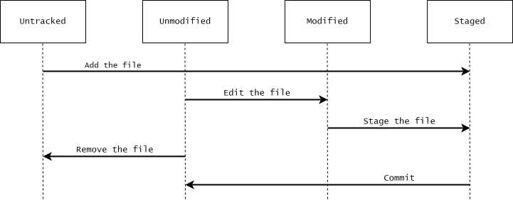

# Getting started

In this chapter we will look at some basic configurations of Git, introduce the most basic Git commands, talk about the different states of files, and finally how you can find help on how to use Git commands.

## Basic configuration of Git {#sec-basic-git-configuration-of-git}

First of all, we need to do some basic configurations of Git, which we will do using the `git config` command. Here we will only briefly explain what commands to type in the terminal without any explanation on how commands actually work, and what exactly they do. If you want to learn more about how to configure Git, see @sec-configuration-of-git.

### Change the core editor

The first, and most important, thing we need to configure, is the text editor that Git opens when you need to type in a message. Git for Windows comes with a Vim installation, and by default Git uses Vim as a text editor. Vim is amazing, but it is also a complete mystery to people who do not know how it works.^[If you open Vim by accident, type `<Esc>:q!<Enter>` to exit it. Pressing `<Esc>` is to make sure you are in normal mode before typing anything else, and `:q!` is a command to quit Vim and discard any unsaved changes.] To change the default editor to Notepad, which is pre-installed on Windows, write the following command in your terminal:

<pre class="git-command">
$ git config set --global core.editor notepad
</pre>

This tells Git to use Notepad as a text editor in all your Git repositories.

### Identify yourself

Another thing you should configure in your Git installation is your username and email. Every commit you make to your Git repository contains information on the identity of the person who made it, and this information should be informative, i.e. be your real name and email. This ensures that if you are collaborating on a Git repository or sharing the repository online, it is clear to others who made what commits to the repository. You can set your username and email by writing the following commands in your terminal:

<pre class="git-command">
$ git config set --global user.name "Your name"
$ git config set --global user.email "your@email.com"
</pre>

## Initializing and cloning Git repositories

To start using Git, we need to either initialize a new Git repository, or clone an existing one.

### Initialize a new Git repository

To initialize a Git repository in a directory, `cd` to the directory and use the `git init` command. This creates an empty Git repository in a new (hidden) subdirectory named ".git".

<pre class="git-command">
$ cd ~ # Change working directory to the home directory
$ mkdir new-git-repository # Make a new directory in home directory
$ cd new-git-repo # Change working directory
$ git init # Initialize Git repository
$ ls -A # List all subdirectories
.git/
</pre>

### Clone an existing Git repository

You can clone an existing Git repository using the `git clone` command. This makes a copy of the repository in a new directory in the working directory.

You can clone a repository from anyway, e.g. from another folder on your machine, from a folder on a network drive, or from a url. The code for this tutorial is on available on Github. You could clone the repository by using the command below:

<pre class="git-command">
$ git clone "https://github.com/thomas-rasmussen/git-tutorial.git"
</pre>

This will clone the repository in a folder named "git-tutorial" in your current work directory.

## Lifecycle of files

Whether you have initialized a new Git repository or cloned an existing one, you now have a Git repository on your local computer. At this point we are going to take a moment to talk about the different states that files in Git repository can be in.

Each file in a Git repository can be in one of two states: *tracked* or *untracked*. Tracked files are files that Git know about, i.e. files that were included in the last snapshot and files that are staged. These files can be unmodified, modified, or staged, but they are all tracked. Untracked files is everything else.

When you edit a tracked file, Git sees it as modified since it is different from the last snapshot. You can then stage files for the next commit, and finally commit them. When you commit the file to a snapshot, the file goes back to being viewed as unmodified. You then then continue editing, staging and commiting files, and thus the cycle repeats.

{width=100%}

## Checking the state of files

So how do we check the state of our files? The main command to do this is `git status`. If you run this command right after cloning a repository or commiting a snapshot of your files, you will see something like this.

<pre class="git-command">
$ git status
On branch main
nothing to commit, working tree clean
</pre>

As the message states, the working tree is clean, i.e. the files in the repository are all unmodified with respect to the last commit. Furthermore, there are no untracked files in the repository, or they would be listed.

## Adding files to the index

To update the index, we use the `git add` command. This will update the index using the current content of the working tree, which can include updating files that are already in the index, include new files, or remove files that are no longer in the working tree. The index holds a snapshot of the content that we want to include in our next commit. To update the index based on all files in the repository you can use the commmand

<pre class="git-command">
$ git add .
</pre>

The "." means "current directory". You can also specify individual files to add to the index:

<pre class="git-command">
$git add file_a.txt file_b.txt
</pre>

## Committing files to the repository

We can commit files to the repository with the `git commit` command. This commands
uses the current content of the index to create a new commit to the repository.

<pre class="git-command">
$ git commit -m"Commit message"
</pre>

If you do not specify a commit message with the `-m` option, Git will open a text editor, and request that you enter one there. After typing the commit message, save the file, and exit the editor.

## Example {#sec-getting-started-example}

Let's create our own Git repository from scratch to illustrate the concepts that have been introduced so far. First, we initialize a new Git repository in the home directory, and `cd` into the directory.

<pre class="git-command">
$ cd ~
$ mkdir git-tutorial-example
$ cd git-tutorial-example
$ git init
</pre>

Lets run `git status` to see the status of the working tree at this point.

<pre class="git-command">
$ git status
On branch main

No commits yet

nothing to commit (create/copy files and use "git add" to track)
</pre>

As expected we are told that nothing has been committed to the repository, and that no files are tracked.

Next, we create a new file in the directory.

<pre class="git-command">
$ echo "Content of file_a.txt" > file_a.txt
</pre>

If we run `git status` again:

<pre class="git-command">
$ git status
On branch main

No commits yet

Untracked files:
  (use "git add <file>..." to include in what will be committed)
        file_a.txt

nothing added to commit but untracked files present (use "git add" to track)
</pre>

Git now notifies us about the presence on an untracked file in the repository. Lets add the file to the index for the next commit, and run `git status` once more:

<pre class="git-command">
$ git add file_a.txt
$ git status
On branch main

No commits yet

Changes to be committed:
  (use "git rm --cached <file>..." to unstage)
        new file:   file_a.txt
</pre>

Git now tells us that file_a.txt has been added to the index and will be included, in its current state, to the next commit. Finally, lets commit the file to the repository and run `git status` a final time:

<pre class="git-command">
$ git commit file_a.txt -m"Add file_a.txt to repository"
$ git status
On branch main
nothing to commit, working tree clean
</pre>

Git now informs us that there is nothing to commit and that the working tree is clean. This is because the current state of file_a.txt is the same as the state of file_a.txt in the repository.

## Accessing manual pages

We will end this chapter with a note on how to access the comprehensive manual help page for any of the Git commands. The manual pages can be accessed in different equivalent ways one of which is:

<pre class="git-command">
$ git help &lt;command&gt;
</pre>

For example, to get the manual page for the `git add` command run

<pre class="git-command">
$ git help add
</pre>

These manual pages are nice because they can be accessed anywhere, even offline. A short summary on how to use the command can also be printed in the terminal by using the `-h` option with a git command:

<pre class="git-command">
$ git help add -h
usage: git add [<options>] [--] <pathspec>...

    -n, --[no-]dry-run    dry run
    -v, --[no-]verbose    be verbose

    -i, --[no-]interactive
                          interactive picking
    -p, --[no-]patch      select hunks interactively
    -U, --unified &lt;n&gt;     generate diffs with &lt;n&gt; lines context
    --inter-hunk-context &lt;n&gt;
                          show context between diff hunks up to the specified number of lines
    -e, --[no-]edit       edit current diff and apply
    -f, --[no-]force      allow adding otherwise ignored files
    -u, --[no-]update     update tracked files
    --[no-]renormalize    renormalize EOL of tracked files (implies -u)
    -N, --[no-]intent-to-add
                          record only the fact that the path will be added later
    -A, --[no-]all        add changes from all tracked and untracked files
    --[no-]ignore-removal ignore paths removed in the working tree (same as --no-all)
    --[no-]refresh        don't add, only refresh the index
    --[no-]ignore-errors  just skip files which cannot be added because of errors
    --[no-]ignore-missing check if - even missing - files are ignored in dry run
    --[no-]sparse         allow updating entries outside of the sparse-checkout cone
    --[no-]chmod (+|-)x   override the executable bit of the listed files
    --[no-]pathspec-from-file <file>
                          read pathspec from file
    --[no-]pathspec-file-nul
                          with --pathspec-from-file, pathspec elements are separated with NUL character
</pre>

## Exercises

### Exercise 1 - Create a new Git repository

::: {.callout-note title="Exercise" collapse="false" icon="false"}
1. Initialize an empty Git repository in a new subdirectory of your home directory  named "ex-init-repo".

2. `cd` into the directory

3. Create a file (any file will do).

4. Add the file to the index.

3. Commit the file to the repository.
:::

::: {.callout-tip title="Hint" collapse="true" icon="false"}
Look at the example in section @sec-getting-started-example.
:::

::: {.callout-important title="Solution" collapse="true" icon="false"}
<pre class="git-command">
$ cd ~ # Make sure the working directory is set to the home directory
$ mkdir ex-init-repo # Make a new subdirectory
$ cd ex-init-repo # cd to new directory
$ git init # Initialize git repository
$ echo "Some content" > file.txt # Create a file in the directory
$ git add file.txt # Add file to index
$ git commit -m"Commit message" # Commit to repository
</pre>
:::

### Exercise 2 - Using the manual pages

In this exercise we will practice using the manual pages. First lets construct a simple git repository with different files in different states.

<pre class="git-command">
$ cd ~
$ mkdir ex-man-pages
$ cd ex-man-pages
$ git init
$ echo "Content of file1" > file1.txt
$ git add file1.txt
$ git commit -m"Add file1.txt"
$ rm file1.txt
$ echo "Content of file2" > file2.txt
$ echo "Content of file3" > file3.txt
$ git add file2.txt
</pre>

If we run `git status` on the repository in this state we get the following output in the terminal

<pre class="git-command">
$ git status
On branch main
Changes to be committed:
  (use "git restore --staged <file>..." to unstage)
        new file:   file2.txt

Changes not staged for commit:
  (use "git add/rm <file>..." to update what will be committed)
  (use "git restore <file>..." to discard changes in working directory)
        deleted:    file1.txt

Untracked files:
  (use "git add <file>..." to include in what will be committed)
        file3.txt
</pre>

The output is rather verbose, and with more files (which is common) it quickly becomes unnecessarily hard to get an overview. It would be great if we could get the output from `git status` in a shorter, more condense, format.

1. Look at the `git status` command documentation, and find an option that can be used to show the status concisely. 

::: {.callout-tip title="Hint" collapse="true" icon="false"}
You can either look at the "OPTIONS" section of manual page using the `git help status`, or you can use `git status -h` to get get a quick overview of how to use the command.
:::

::: {.callout-note title="Solution" collapse="true" icon="false"}
The option we are looking for is `-s`.

<pre class="git-command">
$ git status -s
 D file1.txt
A  file2.txt
?? file3.txt

</pre>
:::

2. Read further into the documentation and find the section explaining the notation used in the short short format. You can skim through the documentation if you want to, but you don't need to use time trying to understand it.

::: {.callout-note title="Solution" collapse="true" icon="false"}
In this case we need to read a little further in the manual page for `git status`. The information we are looking for can be found in the "Short Format" subsection of the section "OUTPUT".
:::

### Exercise 3 - Clone a Git repository

In this exercise we will practice cloning an existing repository, namely the repository you created in the first exercise.

1. Make a directory called "ex-clone-repo" in your home directory and `cd` into it.

2. Clone the repository from the first exercise.

::: {.callout-note title="Solution" collapse="true" icon="false"}
<pre class="git-command">
$ cd ~
$ mkdir ex-clone-repo
$ cd ex-clone-repo
$ git clone ../ex-init-repo # Clones the ex-init-repo repository located in the parent directory (..)
</pre>
:::

### Exercise 4 - Turn an existing directory into a Git repository

Try to make an existing project/folder into a Git repository, and add and commit files to the repository. Consider the following types of files and whether or not it is a good idea to version control them:

1. Source code

2. Generated files

3. Data

4. Personal IDE config files. for example the content of the hidden folder `.Rproj.user` for Rstudio users.

At this point you might wonder if it is possible to tell Git to ignore certain files and file types, so that the worktree is not clogged with untracked files. Yes, it most certainly can. We will get back to that later in the tutorial.

::: {.callout-note title='"Solution"' collapse="true" icon="false"}

We will get back to this subject later in the tutorial, but generally speaking you should version control your code, not your output. so:

1. Definitely yes.

2. Probably not. You can always generate them from the code. In some cases generated file can take a long time to generate, and are small in size. In that case, it might be convenient to just version control such files if we know we might need to look at different version of the files.

3. Depends. If the data is generated from your code, then probably not. If it is "raw" data then maybe.

4. Almost certainly no. Especially not if you are collaborating on a project with other people. 

:::