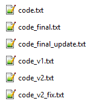
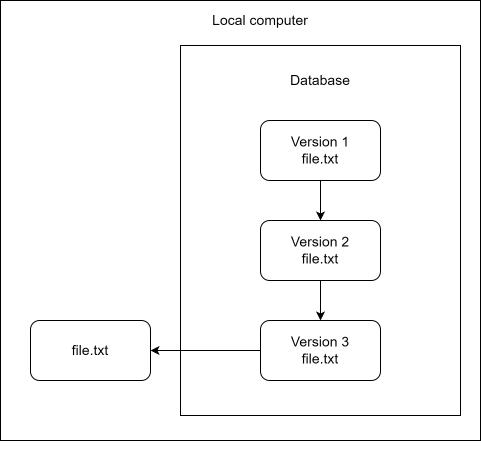
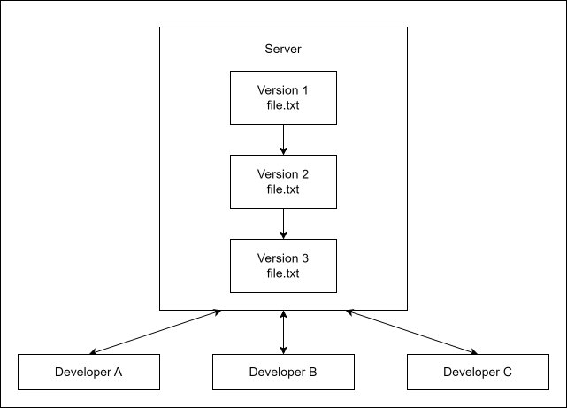
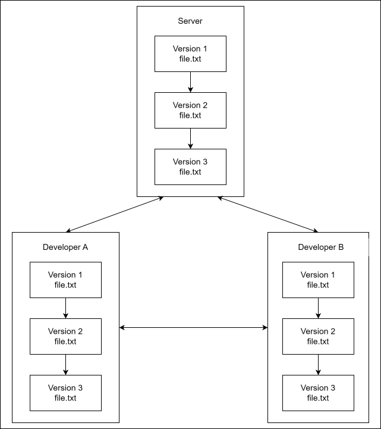
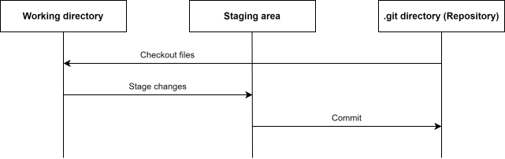
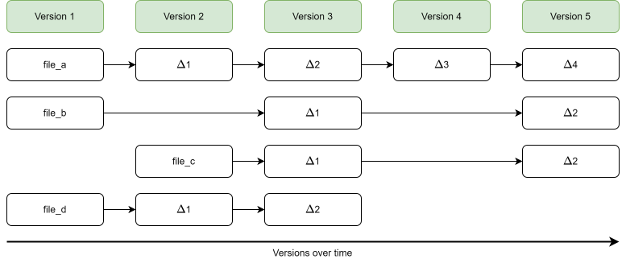
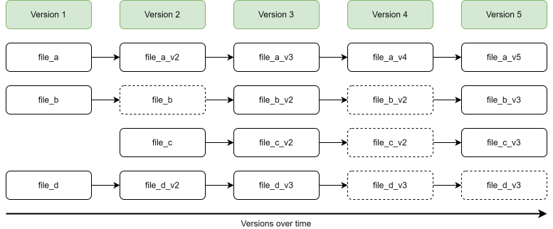

# Introduction to Git

So, what is Git? We will start this tutorial with a short introduction to version control in general, and talk about what Git is and how it works.

## What is version control?

*Version control* is the practice of organizing and tracking different versions of computer files over time. Generally, you can do this for any type of file, but it is primarily done for source code, i.e. plain text files. A *version control system* (VCS) is a software tool that automates version control.

  
You might not realise it, but you are probably already using some form of primitive version control. Does the image on the right look familiar? It is common for people to do manual version control of files by making copies of it and renaming the file. You might even make a folder where you store the old versions separately. The unstructured choice of filenames shown here might seem a bit exaggerated to you, but this pattern of haphazardly naming different versions of files is very common in practice. This approach to version control is obviously less than ideal. Even with a single file, it quickly becomes impossible to discern what version of the file is the newest, and whether or not the history of the file is linear, or if some versions diverge in different direction from some common base version. Furthermore, it is impossible to assess what exactly has changed between versions. Even for small projects with a single developer, this approach clearly has some serious limitations.
  

  <figure>
    
    <figcaption>Versions of a code file</figcaption>
  </figure>

If the above example of file naming seems ludicrous to you, good. That means you have probably already, either implicitly or explicitly, thought about how to organize different versions of your files. You are already on your way to overcoming the biggest hurdle with working with VCS's: working in a structured manner. It is usually not that hard to figure out how to use VCS's, but some people can struggle with the amount of structure that is forced upon them, and have difficulties using VCS's in an effective way, because they are less inclined to accept the premise of working in a structured way that is very unfamiliar to them. If that sounds like like you, try to keep an open mind going forward. To get the full benefit of using a VCS, it might be necessary to make some changes to how you work.

### Local VCS

The first development away from manual version control solutions was so-called local VCS's. A local VCS is a local database on a single computer that keeps track of changes to files. Using a local VCS is can improvement over manual version control and can be useful for small and/or personal projects, but these types of VCS's still have important limitations:

- All file versions are stored locally, making it vulnerable to data loss.

- It is difficult to collaborate with others using a local VCS, since changes can't easily be shared or consolidated.

### Centralized VCS

To overcome the collaboration issues with local VCS's, the next type of VCS that was developed was centralized VCS's. These systems work by having a single central server that contains all the files that are version controlled. Developers can "checkout" files from that server and "commit" changes back to the server. This setup has many advantages over local VCS's.

- A single central repository makes it easy for developers to see the history of changes and current state of files.

- Makes it easy to collaborate with other people.

- Administrators can control what files each developer can access and modify.

However, centralized VCS's still have limitations:

- Single point of failure: If the server dies and no proper backup has been kept, the entire history of the project is lost except whatever snapshots of files people happen to have on their local machines.

- It is typically not possible to work offline. If the central server is temporarily offline or if the developer does not have an internet connection, it is not possible to "commit" changes to files.

- Operations requires communication with the central server which can be slow, especially for large projects.

### Distributed VCS

The final type of VCS's is *distributed* VCS's. With a distributed VCS, developers don't just checkout the latest version of files, they make a copy of the entire history of all files. Distributed VCS's have several advantages over centralized VCS's.

- No single point of failure. Each developer has the entire history of files.

- Instead of relying on a central server, developers can share and synchronize changes directly with each others.

- Developers can work offline.

- Allows for more flexible workflows that are not possible with a single centralized server.

- Some types of operations are faster since you don't need to communicate with a server.

On the other hand distributed VCS's also comes with some downsides:

- Storing the complete history of files can take up a lot more disc space, especially if files includes binary files or the project has a long and complicated history.

- Administrators can not control which individual files each developer can see/modify.

## What is Git?

So what is Git and how did it come to be? Git is a distributed VCS, and it is born from controversy. In 2005 the relationship soured between the Linux kernel project and the company owning the proprietary distributed VCS, BitKeeper, that the Linux community was using as a VCS. This resulted in the free licence of BitKeeper that the Linux community was using being revoked. Prompted by this, the Linux developer community (in particular Linus Thorvald, the creator of Linux) developed their own tool, Git, to replace BitKeeper. Git was designed with several key goals in mind that was needed for the Linux kernel project: speed, simple design, strong support for non-linear development, a fully distributed nature, and the ability to handle large projects efficiently.

Git basically works by storing snapshots of the state of your files over time. Git makes it easy to switch between different versions of your code, compare different versions of the same file, see the history of a file over time and much more. 

### The main sections of a Git project

There are three main sections of a Git project: the working tree, the staging area, and the Git directory.

The **working tree** is a version of the project that has been checked out. These files are pulled out of the compressed database of the Git directory and placed on disk for you to use or modify.

The **staging area** is a file in your Git directory that stores information about what will go into your next commit. Its technical name in is the "index", but the phrase "staging area" is also commonly used.

The **Git directory** is where Git stores the metadata and object database for your project. It is located in the ".git" folder. This is the most important part of Git, and it is what is copied when you *clone* (make a copy of) a repository from another computer.

The basic workflow when using Git is something like:

1. You checkout a version of your project you want to work on into the working tree (usually the newest version that is already there).

2. You modify the files in the working tree.

2. You stage (some) changes to be included in the next commit.

3. Commit the changes to the Git repository.

4. Repeat.

If a particular version of a file is in the Git directory, it is considered **committed**. If it has been modified and added to the staging area it is **staged**, and if it was changed since it was checked out but has not been staged, it is said to be *modified*.

### File storing in Git

A major difference between Git and many other VCS's is how Git stores data. In other systems, files are typically stored as a set of base versions of files and the changes made to each file over time. This is commonly called *delta-based* version control.

This is not how Git stores data. In Git, data is stored as a
series of snapshots of your files. Every time you save the state of your files, Git basically takes a picture of how all the files looks like, and stores a reference to that snapshot. To be efficient, if a file has not changed, Git does not store the file again, but saves a link to the previous identical file instead.

### Data integrity

The last subject we will touch upon for now is data integrity in Git. How does Git know that a file has changed, and how does Git ensure that data is not corrupted or tampered with? Git does this by checksumming files.

Any stream of data, for example a file or a directory of files, can be summarized into a single value, a so-called checksum. You can think of a checksum as a fingerprint. Even a single bit flip in a data stream would result in an entirely new checksum. Git checksums *everything*. This means that if something changes, Git will know about it. Git uses this to ensure the integrity of a project. In Git everything is checksummed before it is stored, and stored files/directories are referred to by that checksum. This means that any data corruption will be detected instantly. It also means that if the checksum of your state of a project (a commit ID) matches the checksum of another clone of the project, you can be assured that the entire project up until that point is identical. 

The method that Git uses for making checksums is called a SHA-1 hash. This is a 40-characters string composed of hexadecimal characters and looks something like shown below.

<pre class="git-command">
840552db75d3d52894732b753892427b3f2cafa8
</pre>

Since Git uses checksums so much, you will see these checksums everywhere. In particular, every time you commit a snapshot of your files to your Git repository, the snapshot is associated with a checksum value.