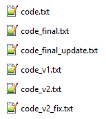
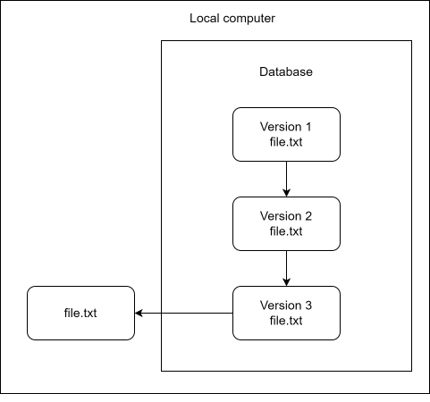
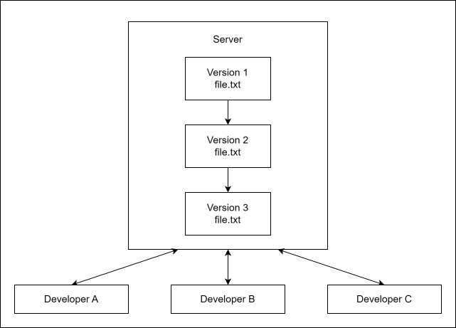
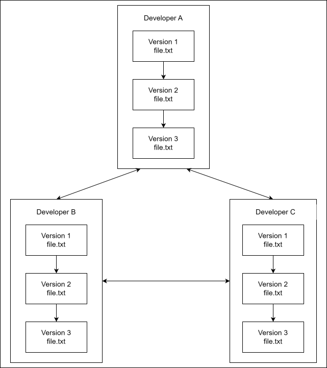
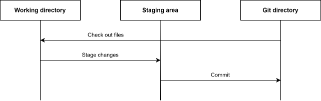
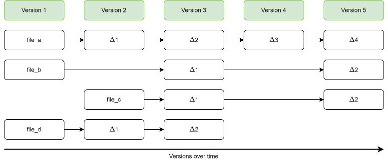
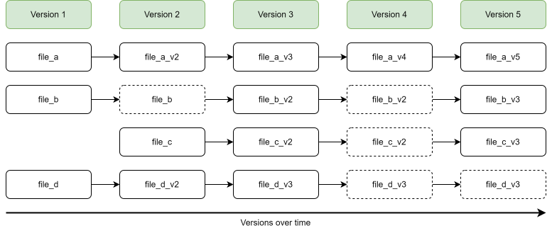

# Introduction to version control and Git {#sec-introduction-to-git}

What is version control and what is Git? We will begin this tutorial with a brief introduction to version control before explaining what Git is and how it works at a broad level.

## What is version control?

*Version control* is the practice of organizing and tracking different versions of computer files over time. Version control can be used for almost any type of file, but is particularly useful for source code, which is typically stored in plain-text files. A *version control system* (VCS) is a software tool that automates version control.

  
You might not realize it, but you are probably already using some form of primitive version control. Does the image on the right look familiar? It is common for people to do manual version control by making copies of files and renaming them. You might even create a separate folder for older versions. The filenames shown here might seem exaggerated, but inconsistent naming like this is common in practice.

Even with a single file, manual version control quickly makes it difficult to determine which version of the file is the newest, and whether the versions follow a linear history or have diverged from a common starting point. Furthermore, it is difficult to assess what exactly has changed between versions. Even for small projects with a single developer, this approach clearly has serious limitations.

Using a VCS provides a more structured way of managing different versions of files. Learning the basics of a VCS is usually straightforward, but if you are not already working in a structured way, getting the full benefit of version control may require adapting some existing work habits.

A VCS addresses many of the problems with manual version control. It keeps a history of changes in a repository, making it possible to see what has changed, when it changed, and who made the changes. It also makes it easier to restore previous versions of files and, depending on the type of VCS, collaborate with others on the same project.

### Local VCS

One type of version control system is the *local VCS*. A local VCS stores the repository on your computer, where changes to files are tracked. Using a local VCS is an improvement over manual version control and can be useful for small or personal projects, but this type of VCS still has important limitations:

- All file versions are stored on your computer, making them vulnerable to data loss if that computer fails.

- It is difficult to collaborate with others using a local VCS, since changes cannot easily be shared or consolidated.

### Centralized VCS

To make collaboration easier, *centralized VCSs* use a repository on a central server. Developers can check out files from the repository and commit changes back to it. Centralized VCSs have several advantages over local VCSs.

- A single central repository makes it easy for developers to see the history of changes and the current state of files.

- A central repository also makes it easier to collaborate with others.

- Administrators can control what files each developer can access and modify.

However, centralized VCSs still have limitations:

- If the server fails and no proper backup exists, the project's version history may be lost, although developers may still have copies of individual files stored locally.

- Committing changes typically requires access to the central server, making it difficult to work fully offline.

- Operations require communication with the central server, which can be slow, especially for large projects.

### Distributed VCS

A different approach is the *distributed VCS*. With a distributed VCS, each developer typically has a local copy of the repository and its history. Distributed VCSs have several advantages over centralized VCSs.

- There is no single point of failure for the repository's history.

- Developers can also share and synchronize changes directly with each other.

- Developers can work offline.

- Distributed VCSs allow for more flexible workflows than centralized VCSs.

- Some operations are faster because they can be performed locally without communicating with a server.

However, distributed VCSs also have some limitations:

- Storing a complete repository history can take up more disk space, especially if the project contains binary files or has a long and complicated history.

- It is difficult to control which files individual developers can access, since they typically have a complete copy of the repository.

## What is Git?

So what is Git, and how did it come to be? Git is a distributed VCS, and it was born out of controversy. In 2005, relations broke down between the Linux kernel development community and the company behind BitKeeper, the proprietary distributed VCS they had been using. This resulted in the withdrawal of BitKeeper's free-of-charge availability to Linux kernel developers. In response, the Linux development community, particularly Linus Torvalds, developed Git as a replacement for BitKeeper.

Git was designed to meet several important requirements of the Linux kernel project: speed, a simple design, strong support for non-linear development, a fully distributed model, and the ability to handle large projects efficiently.

In Git, a project and its version history are managed in what is called a *repository*, often shortened to *repo*. Git works by recording snapshots of your files over time. Git makes it easy to switch between versions of your files, compare versions of the same file, and review the history of individual files.

Although Git was originally developed for large projects involving many developers, it is equally useful for small projects with a single developer.

### Main parts of a Git project

There are three main parts involved when working with a Git project: the Git directory, the working tree, and the staging area.

{width=100%}

The *Git directory* is where Git stores the history of your project, including previous versions of your files.

The *working tree* contains the files you are currently working on. This is where you make changes to your project.

The *staging area* is where you select the changes you want to include in the next commit.

The typical Git workflow is as follows:

1. Modify files in the working tree.

2. Stage the changes you want to include in the next commit.

3. Commit the staged changes to the Git repository.

### How Git stores data {#sec-file-storage-in-git}

A major difference between Git and many other VCSs is how Git stores data. In other VCSs, file histories are typically represented by storing a base version and subsequent changes to each file. This is commonly called *delta-based* version control.

This is not how Git stores data. In Git, data is stored as a series of snapshots of your files. Every time you commit changes, Git records a snapshot of the files in your project and stores a reference to that snapshot. To be efficient, if a file has not changed, Git can reuse its existing stored contents rather than storing them again.

### Summary

In summary, version control provides a structured way to track changes to files, restore earlier versions, and collaborate with others. Git is a distributed version control system that allows developers to keep and work with a project's history locally. In the following chapters, we will look at how to use Git in practice and how Git works in more detail.
