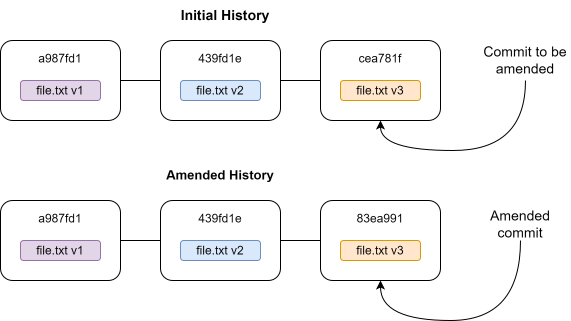

# Undoing changes

While working with Git, you will undoubtedly end up in a situation where you want to "undo" something. Maybe you want to change the commit message of the commit you just did, maybe you forgot to add a file to the staging area before committing, or maybe you committed changes to the repository that you want to delete. Git comes with several commands that can be used to "undo" things, some of which we will illustrate in this chapter. We will also illustrate that some of these commands needs to be used with care, since they can result in you losing work that has not been committed to the Git repository.

## `git commit --amend` - Amending the lastest commit

A common mistake is to make an error in the commit log message, or making a premature commit where you forgot to stage all the intended changes. You could fix the mistake by making another commit where you staged the forgotten changes and/or updated the commit message, but there is a more convenient way to fix these types of issues. You can simply stage the changes you forgot, and use the `git commit --amend` command. 

<pre class="git-command">
$ git commit --amend
</pre>

This will replace the original commit with a new commit where the additional changes have been added. When prompted to enter a commit message during the commit, you will see that the commit message from the original commit has already been filled in, and you can update it as you see fit.

It's important to understand that what Git is doing here is not so much "amending" the commit, but *replacing* it with a new commit that will have a new checksum, as also illustrated in the above diagram. Amending a commit is an example of rewriting the commit history of the Git repository. We will not go into more details on this at this point, but rewriting the commit history should be done with care if you are collaborating with other on a Git repository.

## `git restore` - unstaging staged files and unmodifying modified files.

In this section we will show how we can use `git restore` to restore files in the staging area and working directory with content from a restore source. We can use this to "undo" changes we have staged, or unmodify files we have modified in the working directory.

Lets say we made changes to a file and added the changes to the staging area. How can we "undo" this, ie unstage the file? What we want to do is to restore the staging area to match the content in the working directory. If we create an example Git repository and use the `git status` command, it will actually give us the answer:

<pre class="git-command">
$ mkdir ~/example-git-restore
$ cd ~/example-git-restore
$ git init
$ echo "content" > file_a.txt
$ git add file_a.txt
$ git commit -m"Add file_a.txt"
$ git echo "more content" >> file_a.txt
$ git add file_a.txt
$ git status
On branch main
Changes to be committed:
  (use "git restore --staged <file>..." to unstage)
        modified:   file_a.txt
</pre>

Git is directly telling us that if we want to unstage the changes in file_a.txt that has been added to the staging area, we can use the command `git restore --staged file_a.txt`. Let try that:

<pre class="git-command">
$ git restore --staged file_a.txt
$ git status
On branch main
Changes not staged for commit:
  (use "git add <file>..." to update what will be committed)
  (use "git restore <file>..." to discard changes in working directory)
        modified:   file_a.txt
</pre>

So what does `git restore --staged file_a.txt` do? The `--staged` option is telling git to restore the file_a.txt content in the index, and since we have not specified what source to restore from, git uses the content of file_a.txt from HEAD. This amounts to unstaging the file. As we can see from the output, the file is back to being modfied, but unstaged.

What if we regret the changes we have made to file_a.txt and want to unmodify it entirely, ie restore the file back to how it looked in the last commit? As we can see from the previous output `git status` is again directly giving us the answer: We can use the command `git restore file_a.txt`. Let try it.

<pre class="git-command">
$ git restore file_a.txt
$ git status
On branch main
nothing to commit, working tree clean
$ cat file_a.txt
content
</pre>

We can see that we have now unmodified file_a.txt, ie we have restored the file back to how it looked in the previous command. We have not specified what what to restore or what source to restore from, so by default the working tree is restored with the content from the index. `git restore file_a.txt` is equivalent with `git restore --worktree file_a.txt`

It is important to understand that `git restore <file>` is a dangerous command to use. Git has replaced the file with the latest committed version. Any local changes that have been made are gone.

## `git rm` - Removing files from a Git repository

A common scenario is that you want to stop tracking a file. Git will recognize if you manually delete files in the working directory and will update the working directory automatically. But it will not update the index with the removal of the file, which you would then have to do yourself using `git add`. This two-step process can be done more effectively using the `git rm` command which can be used to remove files from the working tree and index. Lets illustrate it with an example. First, lets set up a repository where we have committed a couple of files:

<pre class="git-command">
$ mkdir ~/example-git-rm
$ cd ~/example-git-rm
$ git init
$ echo "file_a" > file_a.txt
$ echo "file_b" > file_b.txt
$ git add .
$ git commit -m"Add file_a.txt and file_b.txt"
</pre>

First, we remove file_a.txt using the `git rm` command.

<pre class="git-command">
$ git rm file_a.txt
$ git status
On branch main
Changes to be committed:
  (use "git restore --staged <file>..." to unstage)
        deleted:    file_a.txt
$ git commit -m"Remove file_a.txt"
</pre>

Note that file_a is removed from the working tree and that the index has been updated, so
we can use `git commit` directly after removing the file.

Now, lets try manually removing file_b.txt. Note that Git recognizes that the file has been deleted from the repo, but the index is not updated, so we have to use `git add` ourselves to update the index.

<pre class="git-command">
$ rm file_b.txt
$ git status
On branch main
Changes not staged for commit:
  (use "git add/rm <file>..." to update what will be committed)
  (use "git restore <file>..." to discard changes in working directory)
        deleted:    file_b.txt

no changes added to commit (use "git add" and/or "git commit -a")
$ git add file_b.txt
$ git commmit -m"Remove file_b.txt"
</pre>

In conclusion, the `git rm` command is not an essential command, but it is convenient and allows you to handle removal of files from your Git repository using git commands instead of relying on more fundamental shell commands.

## `git reset` - "Undoing" a commit

The `git reset` command is quite versatile and can also be used instead of the `git restore` command. For now, we will simply show how to use it to "undo" a commit that we have made, without going into details that uses concepts we have not introduced yet.

Imagine you have the following Git repository where you just commmited some changes that you regret, and now you want to remove them.

<pre class="git-command">
$ mkdir ~/example-git-reset
$ cd ~/example-git-reset
$ git init
$ echo "content" > file.txt
$ git add .
$ git commit -m"Add file.txt"
$ echo "content we will regret adding" >> file.text
$ git add .
$ git commit -m"Update file.txt"
</pre>

We can do this by finding the checksum of the previous commit and "reset" the Git repository to that commit:

<pre class="git-command">
$ git log --oneline
246b682 (HEAD -> main) Update file.txt
c481e82 Add file.txt
$ git reset --hard c481e82
HEAD is now at c481e82 Add file.txt
$ gitr log --oneline
c481e82 (HEAD -> main) Add file.txt
</pre>

## Exercises

### Exercise 1 - Amend a commit

In this Exercise we will practice amending a commit. Run the following code to set-up a Git repository with a commit we want to amend:

<pre class="git-command">
$ mkdir ~/ex-amend
$ cd ~/ex-amend
$ git init
$ echo "content of file_a" > file_a.txt
$ echo "content of file_b" > file_b.txt
$ echo "content of file_c" > file_c.txt
$ git add file_a.txt
$ git commit -m"Add file_a.txt"
</pre>

In the Git repository created by these commands, we have made a commit adding file_a.txt to the repository, but we forgot to add file_b.txt and file_c.txt!

**1. Find the checksum of the commit**^[Note that the checksums in this exercise will be different for every person]**.**

::: {.callout-note title="Solution" collapse="true" icon="false"}
You can use the `git log` command to see the checksum of the commit. You could also additionally use the `--oneline` option to get a nice one-line output with a short version of the checksum:

<pre class= "git-command">
$ git log --oneline
712d2c6 (HEAD -> main) Add file_a.txt
</pre>

:::

**2. Amend the commit by adding file_b.txt and file_c.txt. "Forget" to update the commit message.**

::: {.callout-note title="Solution" collapse="true" icon="false"}
You can use the `--no-edit` option to tell Git to use reuse the original commit message:
<pre class="git-command">
$ git add file_b.txt file_c.txt
$ git commit --amend --no-edit
</pre>
Alternatively, you can omit the `--no-edit` option, and simply keep the current commit message that Git opens in a text editor.
:::

**3. Look at the commit checksum again. Has it changed? Why?**

::: {.callout-note title="Solution" collapse="true" icon="false"}
<pre class="git-command">
$ git log --oneline
0ef247d (HEAD -> main) Add file_a.txt
</pre>

The checksum has changed. The reason for this is that Git has amended the commit by *replacing* it with a new commit. This new commit does not have the same content, so the checksum is different.
:::

**4. Amend the commit again to update the commit message we "forgot" to update in the previous amended commit.**

::: {.callout-note title="Solution" collapse="true" icon="false"}
<pre class="git-command">
$ git commit --amend -m"Add file_a.txt, file_b.txt, and file_c.txt"
</pre>

Here we use the optional `-m` option to specify the commit message directly in the command so that we don't have to type it in the text editor Git would otherwise open.
:::

**5. Look at the commit checksum again. Has it changed? Why?**

::: {.callout-note title="Solution" collapse="true" icon="false"}
<pre class="git-command">
$ git log --oneline
cade118 (HEAD -> main) Add file_a.txt, file_b.txt, and file_c.txt
</pre>

The checksum has changed again. Again, the commit has been replaced by a new commit where we have updated the commit message. Since the commit message is part of the the commit that has been checksummed, the checksum has changed.
:::

### Exercise 2 - Using `git restore`

Run the following commands to set-up a Git repository for the exercise.

<pre class="git-command">
$ mkdir ~/ex-git-restore
$ cd ~/ex-git-restore
$ git init
$ echo "file_a content" > file_a.txt
$ echo "file_b content" > file_b.txt
$ git add . # Add all files
$ git commit -m"Add file_a.txt and file_b.txt"
$ echo "more content" >> file_a.txt
$ echo "more content" >> file_b.txt
$ git add .
</pre>

Here we have created a Git repository where we have committed two files, then made changes to both files and added them to the index.

**1. Unstage file_b.txt and commit file_a.txt.**

We were too fast on the trigger. We actually don't want to commit the changes to both files at the same time. Unstage file_b.txt and commit only file_a.txt.

::: {.callout-note title="Solution" collapse="true" icon="false"}
<pre class="git-command">
$ git restore --staged file_b.txt
$ git commit -m"Update file_a.txt"
</pre>
:::

**2. Unmodify file_b.txt**

Upon further introspection, we decide that we do not want to commit the changes we have made to file_b.txt after all. Unmodify file_b.txt, ie restore the working directory to look like it did in the previous commit.

::: {.callout-note title="Solution" collapse="true" icon="false"}
<pre class="git-command">
$ git restore file_b.txt
$ git status
On branch main
nothing to commit, working tree clean
$ cat file_b.txt
file_b content
</pre>
:::

### Exercise 3 (optional/hard) - Removing a modified/staged file from a Git repository

Setup a Git repository with a modified and staged filed with the commands below:

<pre class="git-command">
$ mkdir ~/ex-git-rm
$ cd ~/ex-git-rm
$ git init
$ echo "file_a" > file_a.txt
$ echo "file_b" > file_b.txt
$ git add .
$ git commit -m"Add file_a.txt and file_b.txt"
$ echo "more content" >> file_a.txt
$ echo "more content" >> file_b.txt
$ git add file_b.txt
</pre>

**1. Attempt to use `git rm` to remove file_a.txt. What happens?**

**2. Explore the documentation to figure out why this happens**

$ git status
On branch main
Changes not staged for commit:
  (use "git add <file>..." to update what will be committed)
  (use "git restore <file>..." to discard changes in working directory)
        modified:   file_a.txt

no changes added to commit (use "git add" and/or "git commit -a")
</pre>

Remove file_a using git rm. Note that file_a is removed from the working tree and the index is updated.

<pre class="git-command">
$ git rm file_a.txt
$ git status
$ git commit -m"Remove file_a.txt"
</pre>

Manually remove file_b. Note Git recognizes that the file has been deleted from the repo, but the index is not updated.

<pre class="git-command">
$ rm file_b.txt
$ git status
$ git add file_b.txt
$ git commmit -m"Remove file_b.txt"
</pre>`

## Exercise 4 - "Undo" commits

Run the following commands to set-up a Git repository:

<pre class="git-command">
$ mkdir ~/ex-undo-commit
$ cd ~/ex-undo-commit
$ git init
$ echo "content" > file.txt
$ git add .
$ git commit -m"Add file.txt"
$ echo "more content" >> file.txt
$ git add .
$ git commit -m"Update file.txt"
$ echo "even more content" >> file.txt
$ git add .
$ git commit -m"Update file.txt again"
</pre>

Here, we have added a file, file.txt, and made changes to it in two commits. At this point we realize that we do not want to make these changes to the file after all. 

"Undo" the last two commits to restore the file to the original state before we started making changes to it.

::: {.callout-note title ="Solution" collapse=true icon=false}
We can use the `git reset`` command to reset the Git repository to the state before we started making changes to file.txt

<pre class="git-command">
$ git log --oneline
2cd5429 (HEAD -> main) Update file.txt again
1836bbe Update file.txt
4387462 Add file.txt
$ git reset --hard 4387462
$ git log --oneline
4387462 (HEAD -> main) Add file.txt
</pre>
:::

