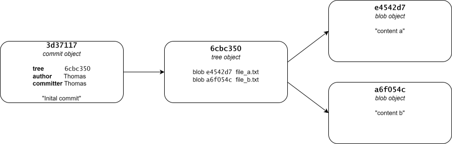
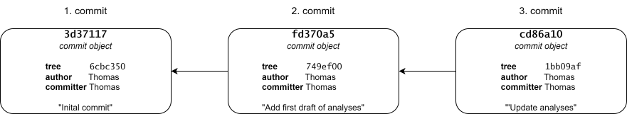
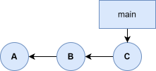
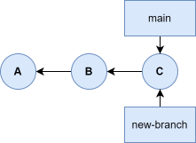
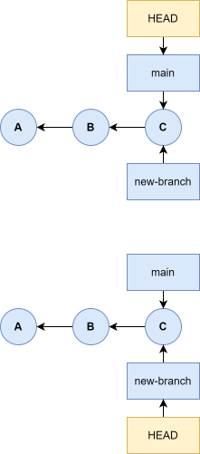

TODO
- When -all flag to git log is first used, make sure to explain why it is needed. Same with --graph
- Go into how the index works? Not done expclitly in Pro Git chapter, but would be natural to do here
  as well? 
- Would it make sense to use a little more time to explain what refs are here, so that we can talk about
  how HEAD is a ref? (is that even correct?)
- Exercise idea: It would probably be a good idea to make an (optinal/technical) exercise alike to the
  example as one of the last exercises in the chapter.
- Add a ton of diagrams
  

# Branching and merging {#sec-branching-and-merging}

In this chapter we will introduce the concept of branches and merging. Branching means diverging from the main version of the code, making changes that does not interfere with the main version. Merging is the process of reconciling two (or more) versions of the code after branching.

Branching is incredibly lightweight in Git, making switching back and forth between branches almost instantaneous. Git encourages a workflow where you branch and merge often. Understanding and mastering branching and merging is an essential part of using Git in a productive way, and will (hopefully) change how you think about and develop your code.


## Data storage in Git

To understand how branching works in Git, we need to take a step back and discuss how Git stores data in more details. As mentioned in @sec-file-storage-in-git, Git stores data as a series of snapshots. When you commit a version of files to a Git repository, Git makes a commit object using the index, that contains a pointer to the snapshot of content you staged for that commit. Beside the state of files included in the commit, the commit object also contains meta data on the author's name and email (and this is why you should configure your Git installation), the commit message, and finally pointers to the commit, or commits, that came directory before it, ie its parent commit(s). The initial commit in a Git repository has no parent commit, a normal commit has one parent, and a merge commit has multiple parents (more on this later). 

To illustrate how all this works, lets make an example repository and go through the details step-by-step. First, lets initialize an empty repository:

<pre class="git-command">
$ mkdir ~/example-data-storage
$ cd ~/example-data-storage
$ git init
$ ls .git/
HEAD  config  description  <span class="bash-violet">hooks  info  objects  refs</span>
$ ls .git/objects/ -R
.git/objects/:
info  pack

.git/objects/info:

.git/objects/pack:
</pre>

Since we have an empty repository at this point, we do not have an index file yet in `.git/`, and `objects/` is empty (besides the empty `pack/` and `info/` directory).

The index is stored as a binary file in the .git folder, and objects that have been added to the index and/or have been committed to the repository, is stored in .git/objects. When you stage files, Git computes a checksum for each file (the SHA-1 hash), and stores the content of that version of the file in the Git repository under that checksum name(referred to in Git as *blobs*), and adds the checksum to the staging area.

Intuitively, you would think that the index holds a copy of all the files that goes into the commit. This is not the case. The index is just a sorted list of path names and the SHA-1 checksum of a blob object. We can use the `git ls-files --stage` command to show us the content of the index.

TODO: expand above explaination


Lets add a couple of files to the repository and stage them: 

<pre class="git-command">
$ echo "content a" > file_a.txt
$ echo "content_b" > file_b.txt
$ git add .
$ ls .git/
HEAD    description  index  <span class="bash-violet">objects</span>
config  <span class="bash-violet">hooks        info   refs</span>
$ ls .git/objects/ -R
.git/objects/:
<span class="bash-violet">a6  e4  info  pack</span>

.git/objects/a6:
f054ce35dbe029a40a758df1e00103e6473e75

.git/objects/e4:
542d77807392d80eb449356baa55c0cb657546

.git/objects/info:

.git/objects/pack:
</pre>

We can see that after we have created and staged `file_a.txt` and `file_b.txt`, an `index` file has been added in `.git/`, and that two objects have been added to the git repository, referred to by checksum values. We can also see that Git groups the objects in folders based on the first two characters of the checksum. 

We can also inspect the index:

<pre class="git-commmand">
100644 e4542d77807392d80eb449356baa55c0cb657546 0       file_a.txt
100644 a6f054ce35dbe029a40a758df1e00103e6473e75 0       file_b.txt
</pre>

TODO: need some more explaination on index content here: use https://shafiul.github.io//gitbook/7_the_git_index.html

To inspect the content of our newly created blobs/objects, we need to use a low-level git command, `git cat-file` since objects are not stored as plain text-file, but is instead stores in other formats for efficiency reasons:

<pre class="git-command">
$ git cat-file -y a6f054ce # Use -t option to the see the type of the object
blob
$ git cat-file -t e4542d77 
blob
$ git cat-file -p a6f054ce # Use -p option to print the content based on its type
content b
$ git cat-file -p e4542d77 
content a
</pre>

First of all, notice how we can refer to checksums without using the full checksum value. Generally speaking, we only need to use the 7 first characters. We can see that the content of the object a6f054ce corresponds to the content of `file_b.txt` and that the content of object e4542d77 corresponds to the content of `file_a.txt`. Next, lets inspect the index using the low-level command `git ls-files`:

<pre class="git-command">
$ git ls-files --stage
100644 e4542d77807392d80eb449356baa55c0cb657546 0       file_a.txt
100644 a6f054ce35dbe029a40a758df1e00103e6473e75 0       file_b.txt
</pre>
Here we have used the `--stage` option to get some information on staged files,
most importantly the checksum and the name of the file, which is used to pull the relevant objects from the object database to include in the commit and name them.

When we run `git commit`, Git checksums each subdirectory (which is just the project root directory containing `file_a.txt` and `file_b.txt` in this example), and stores them as a tree object in the Git repository. Git then creates a commit object that has the metadata and a pointer the the root project tree so it can re-create that snapshot when needed. Let continue our example to see this for ourselves:

<pre class="git-command">
$ git commit -m"Initial commit"
[main (root-commit) 3d37117] Initial commit
 2 files changed, 2 insertions(+)
 create mode 100644 file_a.txt
 create mode 100644 file_b.txt
</pre>

There is a lot of cryptic information outputted to the terminal, but of importance Git tells us that two files have been changed and lists the files. Additionally, we can see that a commit object has been made with the (abbreviated) checksum 3d37117. Before we take a closer look at this commit, lets first look at the index and the objects in the Git repository again:

<pre class="git-command">
$ git ls-files --stage # No output now, nothing is staged for the next commit
$ ls .git/objects/
<span class="bash-violet">3d  6c  a6  e4  info  pack</span>

.git/objects/3d:
37117e6c4403d116729f4da34602e98b9706ec

.git/objects/6c:
bce5031690670decc52d19e348c4a157beec9c

.git/objects/a6:
f054ce35dbe029a40a758df1e00103e6473e75

.git/objects/e4:
542d77807392d80eb449356baa55c0cb657546

.git/objects/info:

.git/objects/pack:
</pre>

We can see that two new objects have been added to the database. One of the objects, 3d37117, is the commit object, and the other, 6cbce50, is the tree object included in the commit object, as we shall see in a moment. Lets take a closer look at the commit object:

<pre class="git-command">
$ git cat-file -t 3d37117
commit
$ git cat-file -p 3d37177
tree 6cbce5031690670decc52d19e348c4a157beec9c
author Thomas Rasmusssen <myemail@gmail.com> 1764186694 +0100
committer Thomas Rasmussen <myemail@gmail.com> 1764186694 +0100

Initial commit
</pre>

We see, as expected, that the commit object consists of a pointer to a tree object, 6cbce50 (the other object that was added to the database together with the commit object), information on the person who made the commit, a pointer to the parent commit, and the commit message. In this case the line with information on the parent commit is empty since this is the initial commit in the repository. 

Lets take a closer look at the tree object while we are at it:

<pre class="git-command">
$ git cat-file -t 6cbc350
tree
$ git cat-file -p 6cbc350
100644 blob e4542d77807392d80eb449356baa55c0cb657546    file_a.txt
100644 blob a6f054ce35dbe029a40a758df1e00103e6473e75    file_b.txt
</pre>

As expected, the tree object contains a list of the files/blobs included in the commit.

To summarize, our Git repository now contains four objects, two blobs (each representing the contents of one of the two files), one tree that lists the content of the directory and specifies which file names are stores in which blobs, and one commit object with a pointer to that root tree and all the commit metadata. A visual representation of the structure of the commit object can be seen below.

<div style="width:100%;margin:auto">

</div>

If we now make additional changes and commit again, the next commit also stores a pointer to the previous commit (the parent commit).

<div style="width:100%;margin:auto">

</div>


## Create and switch to a branch
<div style="display: grid; grid-template-columns: 70% 30%">
<div style="grid-column: 1">

So what is a branch? A branch is simply a lightweight^[it is literally just a file storing the SHA-1 checksum of a commit] movable pointer to a commit object. The default branch is called main (master if you are running an older version of Git). Every time you make a commit, the main branch pointer is automatically moved forward to the new commit. It is worth noting that there is nothing special about this branch, but most repositories have a branch called main (or again, master), since this is the default name that is used when you initialize a repository with `git init`.

</div>

<div style="grid-column: 2">
  <figure>
    
    <figcaption>Illustration of branch pointer</figcaption>
  </figure>
</div>
</div>

<div style="display: grid; grid-template-columns: 70% 30%">
<div style="grid-column: 1">

You can have multiple branches in a Git repository, but how does this work? The answer is more movable pointers. You can create a new branch with the `git branch` command. For example, if you want to create a new branch with the name "new-branch" you can use the command `git branch new-branch`, which will create a new pointer to the commit you are currently on.

</div>
<div style="grid-column: 2">
  <figure>
    
    <figcaption>Creating a new branch</figcaption>
  </figure>
</div>

</div>

<div style="display: grid; grid-template-columns: 70% 30%">
<div style="grid-column: 1">
How does Git know which branch you are currently on? More pointers. Git has a special pointer called HEAD. This pointer points to the branch you are currently on. If we want to switch what branch we are on, we can use the `git switch` command, eg if after creating the branch "new-branch", if we want to switch to that branch, we can use `git switch new-branch`. This moves the HEAD pointer to the "new-branch" branch, and updates the files in the working tree to reflect the state the files are in in the commit that `new-branch` is pointing to. In this simple example, nothing is updated, since both `main` and `new-branch`is pointing to the same commit. 
</div>
<div style="grid-column: 2">
  <figure>
    
    <figcaption>Moving HEAD from one branch to another</figcaption>
  </figure>
</div>
</div>


## Fast-forward merge

The simplest type of merge is a fast-forward merge, which we will illustrate with an example. Imagine we have the following basic repository with a single commit of a single file:

<pre class="git-command">
$ mkdir ./fast-forward-merge
$ cd ./fast-forward-merge
$ git init
$ echo "content" > file.txt
$ git add .
$ git commit -m"Add file.txt"
</pre>

Lets say that everything is working as intended in our repository right now, but that we want to update file.txt with some changes. Instead of making these changes directly on the main branch, we create a new branch, test, where we develop the changes:

<pre class="git-command">
$ git switch -c test
$ echo "add changes" >> file.txt
$ git add .
$ git commit -m"Add changes to file.txt
$ echo "add more changes" >> file.txt
$ git add .
$ git commit -m"Add more changes to file.txt"
$ git log --oneline --all --graph
* 82b0b49 (HEAD -> test) Add more changes to file.txt
* 0242a6a Add changes to file.txt
* ee99f60 (main) Add file.txt
</pre>

At this point we are happy with our changes to file.txt, and we now want to merge these changes into the main branch of the repository. We can do this by switching back to the main branch and use the `git merge` command to merge another branch into our active branch:

<pre class="git-command">
$ git switch main
$ git merge test
Updating ee99f60..82b0b49
Fast-forward
 file.txt | 2 ++
 1 file changed, 2 insertions(+)
git log --graph --oneline --all
* 82b0b49 (HEAD -> main, test) Add more changes to file.txt
* 0242a6a Add changes to file.txt
* ee99f60 Add file.txt
</pre>

When doing the merge, we can see the phrase "Fast-forward" in the output. Because the commit 82b0b49 that the test branch is pointing to is directly ahead of the ee99f60 commit that the main branch is pointing to, we can merge the test branch to the main branch by simply moving the main branch pointer to the commit that the test branch is pointing at. In other words: in this simple scenario, the branches does not diverge, so we can simply "fast-forward" the main branch pointer.

## Merge commit

Suppose we have a repository with two files,, where we experiment with updating one of the files in a separate branch:

<pre classs="git-command">
$ mkdir ./merge-commit
$ cd ./merge-commit
$ git init
$ echo "content" > file1.txt
$ echo "content" > file2.txt
$ git add .
$ git commit -m"Add file1.txt and file2.txt"
$ git switch -c update-file2
$ echo "more content" >> file2.txt
$ git add .
$ git commit -m"Update file2.txt"
</pre>

While working on this update to file2.txt, we discover that we have a bug in file1.txt that we want to fix immediately on the main branch, independent of the work we are currently doing on file2.txt. So we switch back to the main branch and fix the bug there:

<pre class="git-command">
$ git switch main
$ echo "fix bug" >> file1.txt
$ git add .
$ git commit -m"Fix bug in file1.txt"
$ git log --oneline --all --graph
* 9b14dc1 (HEAD -> main) Fix bug in file1.txt
| * f9bcc9e (update-file2) Update file2.txt
|/
* c2c50b0 Add file1.txt and file2.txt
</pre>

After doing this, we revisit our work on file2.txt and come to the conclusion that we are satified with the changes to file2.txt, and that we want to merge then into the main branch. Again, we switch to the main branch and use `git merge` to do this:

<pre class="git-command">
$ git switch main
$ git merge update-file2
Merge made by the 'ort' strategy.
 file2.txt | 1 +
 1 file changed, 1 insertion(+)
$ git log --oneline --graph --all
*   e553fcb (HEAD -> main) Merge branch 'update-file2'
|\
| * f9bcc9e (update-file2) Update file2.txt
* | 9b14dc1 Fix bug in file1.txt
|/
* c2c50b0 Add file1.txt and file2.txt

After using `git merge` Git open a text editor where it prompt us to enter a commit message. Here we have just accepted the pre-specified message "Merge branch 'update-file'". In this case we can see that a simple fast-forward merge was not used. This is because our two branches diverge, and we can't simply move the main branch pointer forward. Instead, Git informs us that is has made a merge using the "ort" strategy. This is the default way Git tries to resolve merges, and can be used when we are trying to resolve a merge of two branches, which is what you will be doing most, if not all, the time. The "ort" strategy is a 3-way merge, where Git identifies the common ancestor commit from where the branches diverged (in this case c72c50b0), and uses this commit together with the commits pointed to by our two branches to create a new so-called "merge commit" (e53fcb) that incorporates the changes from both branches. Merge commits are special in the sense that they have more than one parent (in this case f9bcc9e and 9b14dc1).


## Merge conflicts

So far, everything has been going smoothly: we simply use `git merge` to merge branches, and Git will figure out how to do it automatically, using either a fast-forward merge or a 3-way merge. But this will not always be the case. Sometimes there will be merge conflicts that has to be resolved manually. Take the following scenario: 

<pre class="git-command">
$ mkdir ./merge-conflict
$ cd ./merge-conflict
$ git init
$ echo "content" > file.txt
$ git add .
$ git commit -m"Add file.txt"
$ git switch -c new-branch
$ echo "new content from new-branch branch" >> file.txt
$ git add .
$ git commit -m"Add new content to file.txt on branch new-branch"
$ git switch main
$ echo "new content from main branch" >> file.txt
$ git add .
$ git commit -m"Add new content to file.txt on branch main"
$ git log --oneline --all --graph
* 10c4145 (HEAD -> main) Add new content to file.txt on branch main
| * 9e600a9 (new-branch) Add new content to file.txt on branch new-branch
|/
* 1593545 Add file.txt
</pre>

Again, we will try to merge the new-branch branch to main by using `git merge`:

<pre class="git-command">
$ git merge new-branch
Auto-merging file.txt
CONFLICT (content): Merge conflict in file.txt
Automatic merge failed; fix conflicts and then commit the result.
</pre>

This time we are informed by Git that we have a merge conflict in file.txt. This is because
we have made diverging changes to file.txt in our two branches, so it is not clear how to merge
these two versions of the file; we will have to tell Git manually how to do this. Git informs us that we need to fix the conflicts and then commit the results. Lets start by running `git status`:

<pre class="git-command">
$ git status
On branch main
You have unmerged paths.
  (fix conflicts and run "git commit")
  (use "git merge --abort" to abort the merge)

Unmerged paths:
  (use "git add <file>..." to mark resolution)
        both modified:   file.txt

no changes added to commit (use "git add" and/or "git commit -a")
</pre>

Git tells us that we can about the merge by using `git merge --abort`, which is nice to know. Git also lists all files that has merge conflicts that has not been resolved, in this case the file file.txt. Lets see the state of file.txt:

```{=html}
<pre class="git-command">
$ cat file.txt
content
<<<<<<< HEAD
new content from main branch
=======
new content from new-branch branch
>>>>>>> new-branch
</pre>
```

We can see that Git has added markings to our file. The line "content" is the same in both versions of the file, so the first line is simply "content", but the second line of the file is different for each branch, as indicated by the markings added to the file. Here the top part separated by "=======" referred to as HEAD is the version of the line from the branch we are currently one, namely main, and the bottom part referred to as new-branch is the version of the line from the new-branch branch. We can now edit the file manually to tell Git how we want to resolve this. In this example, lets say we decide that we want to to include the changes from both versions. We can do this by simply removing the markings that Git has added to file manually in our favorite text editor, eg we could use `notepad file.txt` to open the file in Notepad. To illustrate how the file is supposed to look like we will do this with the echo command instead here, using the `-e` flag to enable interpretation of backslash escapes, so we can use `\n` to create a new line:

<pre class="git-command">
$ echo -e "content\nnew content from main branch\nnew content from new-branch branch"
content
new content from main branch
new content from new-branch branch
$ echo -e "content\nnew content from main branch\nnew content from new-branch branch" > file.txt
$ cat file.txt
content
new content from main branch
new content from new-branch branch
</pre>

Git told us that after we have resolved the conflict, we are to use `git add` to mark the changes, so lets do that:

<pre class="git-command">
$ git add .
$ git status
On branch main
All conflicts fixed but you are still merging.
  (use "git commit" to conclude merge)

Changes to be committed:
        modified:   file.txt
</pre>

After running `git status` again, we can now see that the conflicts have been resolved, and that we can use `git commit` to conclude the merge:

<pre class="git-command">
$ git commit
[main 01554d1] Merge branch 'new-branch'
</pre>

This will again prompt Git to open a text editor, where we can enter a commit message. Here, we just keep the pre-specified message "Merge branch 'new-branch'". Finally, we can use `git log` to see the commit history, and check that the content of file.txt in the merge commit is as expected:

<pre class="git-command">
$ git log --all --oneline --graph
*   01554d1 (HEAD -> main) Merge branch 'new-branch'
|\
| * 9e600a9 (new-branch) Add new content to file.txt on branch new-branch
* | 10c4145 Add new content to file.txt on branch main
|/
* 1593545 Add file.txt
$ cat file.txt
content
new content from main branch
new content from new-branch branch
</pre>


## Exercises
  


