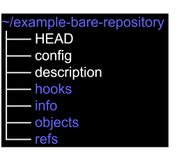
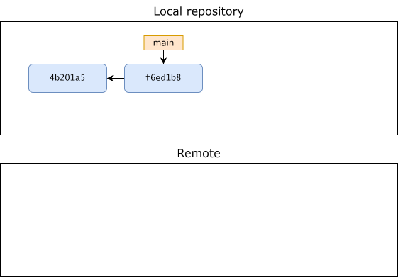
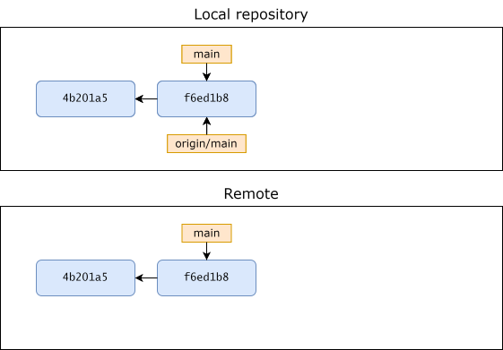
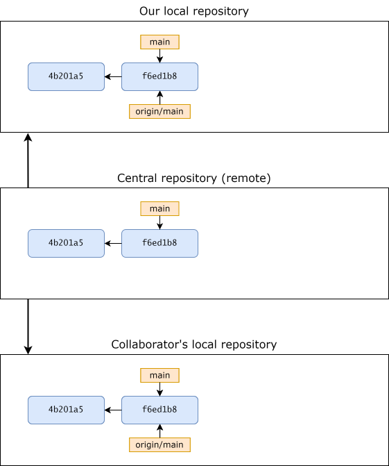
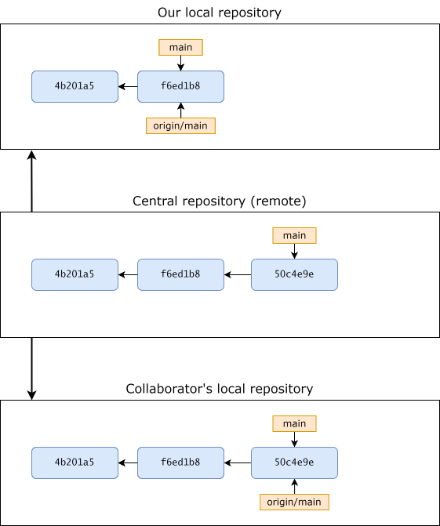
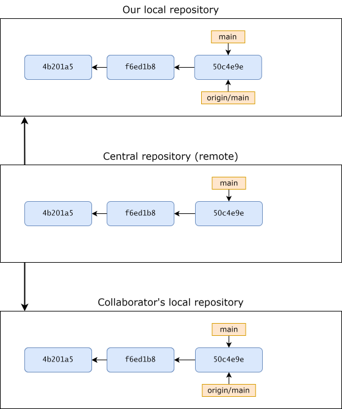

# Remote repositories

Remote repositories, also just called remotes, are versions of your repository that are hosted somewhere else. This could be on the internet somewhere, for example on a Git hosting website like GitHub, or somewhere else on your computer/network. 

Remotes are essential for collaboration on a Git project. When collaborating with others, a remote can be used as a central repository where the "true" code lives. Each collaborator has their own local clone of the project where they make changes. When a collaborator wants to share changes they have made with others, they can "push" the changes from their local clone of the project to the remote, and other collaborators can integrate these changes into their own local clones by "fetching"/"pulling" the changes from the remote. 

Remotes are also useful outside of collaborating with others. When working alone on a project, using a Git hosting website makes it easy to share your code with others, or even with yourself if you are working on a project from different computers. Having a (local) remote as a backup can also be handy. It is possible to undo most commands in Git, but sometimes (especially if you are not an experienced Git user) it happens that you so thoroughly mess something up in a Git repository, that it is just easier to delete the whole thing and make a new clone from your backup instead of trying to undo your mistake^[This is of course only a viable solution if you update your remote regularly and have good workflow in Git. This is something we will talk more about in a later chapter.].

## Bare repositories

In this chapter we will primarily consider remotes intended to be used as "central" repositories or backups in the ways described above. This is the main way remotes are used. In these cases, remotes are not used for local development, ie you are not working directly in a remote, making changes to files, making commits etc. This means that the remote does not need a working tree where Git places files for you to work on. A Git remote is usually set-up as a *bare* repository. A bare repository works almost the same as a normal repository except it has no working tree, so you can't use Git commands that uses the working tree, eg `git status` and `git add`. By default, Git will also refuse to "push" changes to a non-bare remote, since "pushing" changes to a normal repository can lead to inconsistent working trees and conflicts between collaborators.

To initialize a bare Git repository, we simply use the `--bare` flag with `git init`. A bare repository works almost the same as a normal Git repository, with the major difference that is has no working tree. Because of this, the folder structure of the repository becomes different. In a normal Git repository, the top-level directory contains all the files that are in the working tree, ie the files from the snapshot that is currently pointed to by HEAD. The actual repository is in a subdirectory called ".git". In a bare repository, there is no working tree, and the ".git" folder becomes the top-level directory. Lets create a bare repository to illustrate this:

<pre class="git-command">
$ mkdir ~/example-bare-repository
$ cd ~/example-bare-repository
$ git init --bare
Initialized empty Git repository in ~/example-bare-repository/
</pre>

First, lets look at the structure of the project directory:

<pre class="git-command">
$ ls
HEAD  config  description  hooks/  info/ objects/  refs/
</pre>

Listing the files in the repository, we can indeed see that the content of the top-level directory is what would normally be in the ".git" subdirectory.
Next lets try to use `git status`, a command that uses the worktree:

<pre class="git-command">
$ git status
fatal: this operation must be run in a work tree
</pre>

As expected Git informs us that we can't do this since there is no worktree.

Finally, lets clean up by deleting the repository:

<pre class="git-command">
$ rm -rf ~/example-bare-repository
</pre>

  <figure>
    
    <figcaption>Structure of an empty bare repository </figcaption>
  </figure>

## Adding and showing remotes

If you clone a repository, Git will automatically add the cloned repository as a remote. Remotes can also be added explicitly. Available remotes can be shown with the `git remote` command.

### Automatic creation of remotes in cloned repositories

Lets clone the repository for this tutorial and see what remotes are available:

<pre class="git-command">
$ cd ~
$ git clone https://github.com/thomas-rasmussen/git-tutorial.git
$ cd git-tutorial
$ git remote
origin
</pre>

Since we cloned a repository, Git has automatically added the cloned repository as a remote called "origin". There is nothing special about the name "origin", it is just the default name given by Git. You could call a remote anything, it is just a shortname with which we can easily reference the remote without typing the full URL. Since "origin" is the default name given by Git, the convention is that unless you have reason to do otherwise (for example if you have multiple remotes), just let Git give the remote the name "origin". If we want more information on a particular remote, we can use the `git remote show <remote>` command:

<pre class="git-command">
$ git remote show origin
* remote origin
  Fetch URL: https://github.com/thomas-rasmussen/git-tutorial.git
  Push  URL: https://github.com/thomas-rasmussen/git-tutorial.git
  HEAD branch: main
  Remote branches:
    dev                     tracked
    main                    tracked
  Local branch configured for 'git pull':
    main merges with remote main
  Local ref configured for 'git push':
    main pushes to main (up to date)
</pre>

The command gives us a lot of information which we will discuss in more detail later. For now we will just note that we can see that there is both a "fetch" and "pull" URL, and that the URL is the same; the URL of the cloned repository. Intuitively, this is a little confusing. Why is this specified in separate URL's, and what else could it be than the URL of the remote repository? The reason for this is, that it is possible to set up remotes so that you eg "fetch" information from it, but when you want to integrate your local changes, you "push" them to another remote. We won't explore this further in this tutorial, just know that this is how a remote is set up by default.

Let wrap up by deleting the repository again:

<pre class="git-command">
$ rm -rf ~/git-tutorial
</pre>

### Manually adding a remote

We can also manually add a remote to a repository. Let's illustrate this by example. First let us make a simple project repository with a single commit:

<pre class="git-command">
$ mkdir ~/example-manual-remote1
$ cd ~/example-manual-remote1
$ git init
$ touch file.txt
$ git add .
$ git commit -m"Add file.txt"
</pre>

If we use `git remote` at this point, nothing is printed in the terminal, since this is a repository we have made ourselves, not one we have cloned, so no remotes have been automatically created:

<pre class="git-command">
$ git remote
</pre>

Now lets create an empty bare repository we want to use as a remote:

<pre class="git-command">
$ mkdir ~/example-manual-remote2
$ cd ~/example-manual-remote2
$ git init --bare
</pre>

To add the repository as a remote we can use the `git remote add <name> <url>` command, where `<name>` is the shortname we want to give the remote and with which we can easily reference it instead of using the full URL, and `<url>`, is the URL for the repository. As mentioned before, the convention is to name the remote "origin":

<pre class="git-command">
$ cd ~/example-manual-remote1
$ git remote add origin ~/example-manual-remote2
$ git remote
origin
</pre>

We can now see we have a remote called "origin". If we use the `git remote show <remote>` command on this remote we get a noticeably more sparse output than in our previous example with a remote automatically created by cloning a repository:

<pre class="git-command">
$ git remote show origin
* remote origin
  Fetch URL: ~/example-manual-remote2/
  Push  URL: ~/example-manual-remote2/
  HEAD branch: (unknown)
</pre>

As before, we can see that both the "fetch" and "pull" URL has been set to the same URL, namely the URL of the remote, but other than that we only get the additional information that it is unknown what HEAD is pointing at. This is because the remote is currently just an empty bare repository. All the information on "remote-tracking branches" etc is not present here. We will get back to that later on.

## Removing remotes

If you want to remove a remote for some reason (maybe the remote has been moved to a new server), you can do so using the `git remote remove <remote>` command. Lets remove the remote we just added in the example in the previous example:

<pre class="git-command">
$ git remote remove origin
$ git remote
</pre>

At this point we won't be using these repositories any more, so lets delete them:

<pre class="git-command">
$ rm -rf ~/example-manual-remote1
$ rm -rf ~/example-manual-remote2
</pre>

## Pushing to a remote

If you want to integrate your local changes into a remote, you can *push* your local changes to the remote. You can do this using the `git push <remote> <branch>` command. This will take your local changes on the `<branch>` branch and integrate them into the remote `<branch>` branch, to make the remote reflect the current state of your local clone. Lets illustrate this with an example. Suppose we initialize a Git project and do some work in it:

<pre class="git-command">
$ mkdir ~/example-push-fetch
$ cd ~/example-push-fetch
$ git init
$ echo "Initial content" > file1.txt
$ git add .
$ git commit -m"Add file1.txt"
$ echo "Some more content" >> file1.txt
$ git add .
$ git commit -m"Update file1.txt"
</pre>

Next, lets create a bare repository in another folder that we want to use as a remote. In this example our plan could be to use the remote as a backup:

<pre class="git-command">
$ mkdir -p ~/git-remotes/example-push-fetch
# The -p flag is used to make parent directories as needed,
# In this case the "git-remotes" directory that does not
# currently exists.
$ cd ~/git-remotes/example-push-fetch
$ git init --bare
$ cd ~/example-push-fetch
$ git remote add origin ~/git-remotes/example-push-fetch
$ git remote show origin
* remote origin
  Fetch URL: ~/git-remotes/example-push-fetch/
  Push  URL: ~/git-remotes/example-push-fetch/
  HEAD branch: (unknown)
</pre>

Note that we are placing the remote repository in another folder so we can give it the same name. You don't have to do this, but it is nice if you, or others, have to clone the repository later. This way the cloned repository will automatically have the name "example-push-fetch" and not something like "example-push-fetch-remote".

At this point the remote is empty, and our repository has two commits:

<pre class="git-command">
git log --oneline
f6ed1b8 (HEAD -> main) Update file1.txt
4b201a5 Add file1.txt
</pre>

<figure>
  
  <figcaption>State of repositories after set-up</figcaption>
</figure>

We now decide that we are happy with our local commits, and that we want to push our local changes to the remote. We do this using the aforementioned `git push` command, pushing our local `main` branch to the remote:

<pre class="git-command">
$ git push origin main
Enumerating objects: 6, done.
Counting objects: 100% (6/6), done.
Delta compression using up to 12 threads
Compressing objects: 100% (2/2), done.
Writing objects: 100% (6/6), 489 bytes | 163.00 KiB/s, done.
Total 6 (delta 0), reused 0 (delta 0), pack-reused 0 (from 0)
To ~/git-remotes/example-push-fetch/
 * [new branch]      main -> main
</pre>

The remote does not currently have a main branch (it's completely empty), and we can see in the end of the output that Git has automatically created one and pushed the changes there. The rest of the output is a lot of technical details we will not worry about, but in short, Git is giving us information on the process of identifying and writing objects from our local object database to the remote's object database.

If we run `git log` again, we see the following:

<pre class="git-command">
$ git log --oneline
f6ed1b8 (HEAD -> main, origin/main) Update file1.txt
4b201a5 Add file1.txt
</pre>

<figure>
  
  <figcaption>State of repositories after pushing to remote</figcaption>
</figure>

Git has added a "origin/main" pointer, tracking what commit the main branch in the remote was pointing at the last time we communicated with the remote. We can see that the state of the remote now matches our local repository. Lets run `git remote show` again at this point:

<pre class="git-command">
$ git remote show origin
* remote origin
  Fetch URL: ~/git-remotes/example-push-fetch
  Push  URL: ~/git-remotes/example-push-fetch
  HEAD branch: main
  Remote branch:
    main tracked
  Local ref configured for 'git push':
    main pushes to main (up to date)
</pre>

Git informs us that HEAD is now on the main branch in the remote. Furthermore, we can see that Git has automatically set up remote-branch tracking for the main branch. We will go more into what this means later.

## Fetching

If the state of the remote changes, ie if someone else pushes changes to it, you won't know about it until you communicate with the remote again. We can *fecth* information from the remote with the `git fetch <remote>` command to make Git connect to the remote, download all the data in the remote that is not in your local repository, and update the remote-branch tracking pointers, so they reflect the current state of the remote.

To illustrate how this works in practice, lets expand the previous example. Lets imagine that a collaborator is added to the project to help out. We have already set up a remote that we intended to use as a backup, but now we can use it as as central repository for the project instead. Our new collaborator can get started by simply cloning the remote to set up their own local clone of the current state of the project:

<pre class="git-command">
$ mkdir ~/collaborator
$ cd ~/collaborator
$ git clone ~/git-remotes/example-push-fetch
$ cd example-push-fetch
$ git log --oneline
f6ed1b8 (HEAD -> main, origin/main) Update file1.txt
4b201a5 Add file1.txt git log --oneline
$ git remote show origin
* remote origin
  Fetch URL: ~/git-remotes/example-push-fetch
  Push  URL: ~/git-remotes/example-push-fetch
  HEAD branch: main
  Remote branch:
    main tracked
  Local branch configured for 'git pull':
    main merges with remote main
  Local ref configured for 'git push':
    main pushes to main (up to date)
</pre>

Our collaborator is now ready to contribute to the project. The state of our local repository, our collaborator's, and our central repository (the remote), is now identical, as shown below:

<figure>
  
  <figcaption>State of repositories after collaborator set up</figcaption>
</figure>

Let's imagine our collaborator jumps right into the project by adding a new file and pushing the change to the remote:

<pre class="git-command">
$ echo "New file added by collaborator" > file2.txt
$ git add .
$ git commit -m"Add file2.txt"
$ git push origin main
$ git log --oneline
50c4e9e (HEAD -> main, origin/main, origin/HEAD) Add file2.txt
f6ed1b8 Update file1.txt
4b201a5 Add file1.txt
</pre>

We can see that Git has suddenly added the pointer `origin/HEAD`, which is a little confusing based on what we know right now, but you don't have to worry about that. We can see that HEAD in the remote is pointing at the same commit as the main branch pointer in the remote which makes sense.

At this point the state of the different repositories is as shown below:

<figure>
  
  <figcaption>State of repositories after collaborator pushes</figcaption>
</figure>

Now let's go back to our own local clone of the remote, and use `git log`:

<pre class="git-command">
$ cd ~/example-push-fetch
$ git log --oneline --all
f6ed1b8 (HEAD -> main, origin/main) Update file1.txt
4b201a5 Add file1.txt
</pre>

We have not been communicating with the remote since our collaborator pushed changes to the remote, so the changes are not visible to us. To rectify this we fetch from the remote to update our information about the state of the remote:

<pre class="git-command">
$ git fetch origin
remote: Enumerating objects: 4, done.
remote: Counting objects: 100% (4/4), done.
remote: Compressing objects: 100% (2/2), done.
remote: Total 3 (delta 0), reused 0 (delta 0), pack-reused 0 (from 0)
Unpacking objects: 100% (3/3), 290 bytes | 24.00 KiB/s, done.
From ~/remotes/project_a
   f6ed1b8..50c4e9e  main       -> origin/main
</pre>

The last part of the output tells us we have fetched information on a series of commits on the main branch in the remote. If we look at our commit log again we see the following:

<pre class="git-command">
$ git log --oneline --all
# Note the use of the --all flag is needed here to see the commits on the remote that are not in our local repository.
50c4e9e (origin/main, origin/HEAD) Add file2.txt
f6ed1b8 (HEAD -> main) Update file1.txt
4b201a5 Add file1.txt
</pre>

We can now integrate the changes into our own local repository using `git merge`:

<pre class="git-command">
$ git merge origin/main
50c4e9e (HEAD -> main, origin/main, origin/HEAD) Add file2.txt
f6ed1b8 Update file1.txt
4b201a5 Add file1.txt
</pre>

Once again, the state of our local repository, our collaborator's, and the remote are the same.

<figure>
  
  <figcaption>State of repositories after fetching and merging</figcaption>
</figure>

## Pulling

It is also possible to directly integrate changes from the remote into your local repository by *pulling* from the remote using the `git pull <remote>`. Instead of only fetching information from the remote, pulling fetches information and automatically integrates it into your local repository by performing a merge. While this is handy, the general advice is that it is better to fetch from the remote, and then integrate the changes yourself. This way you can inspect the changes in the remote before deciding if, when and how you want to integrate the changes. Let's illustrate pulling by continuing our previous example.

Let's imagine that our collaborator makes a series of questionable commits and pushes them to the remote:

<pre class="git-command">
$ cd ~/collaborator/example-push-fetch
$ echo "
</pre>

TODO: Introduce pulling. Add more changes to example to illustrate. Make two commits as collaborator, pull from local repo. 

TODO: Add paragarph about how it is usually better to fetch + merge instead of pulling.

TODO: go through old code below. Most/all can be deleted?

TODO: Should this chapter include something on merge conflicts, or should this be done in a chapter on its own? Probably the latter, to break things up. In any case, this should include advice on always fetching before pushing when collaborating.

## Remote branches

TODO: There should probably be a section on this at this point to fill in the details that were ommited earlier in the chapter?

Remotes also have branches, and remote-tracking branches are references to the state of the remote branches. They are local references that represents the state of the remote repository the last time you communicated with the remote. You can't move them, but they are automatically updated every time you communicate with a remote, to make sure that they accurately represents the state of the remote repository. You can think of them as bookmarks that reminds you where the branches in your remote were the last time you connected to them.

Remote-tracking branch names takes the form `<remote>/<branch>`. So, for example, the `origin/main` remote tracking branch is a bookmark telling us where the `main` branch in our `origin` remote was  at, the last time we communicated with the remote. This concept of remote-tracking branches might be a bit confusing, so lets try to illustrate this concept with an example. 

TODO: move below code to section/chapter on merge conflicts?

Git, very helpfully, tells us that we can not do this, since the remote contains work that we do not have locally, and it tells us we can use `git pull` to integrate the remote changes. The last advice on using `git pull` is not necessarily a good idea. This command does multiple things, namely `git fetch` to fetch updated information on refs from the remote, and then using `git merge` to integrate the remote changes directly into our local repository. But we do not know what changes have been pushed to the remote at the time we do a `git pull`, which could be problematic for us. It is better to use `git fetch` ourselves to update our information on the state of the remote repository, and then use `git merge` ourselves if we want to update our local copy:

<pre class="git-command">
$ git fetch
remote: Enumerating objects: 5, done.
remote: Counting objects: 100% (5/5), done.
remote: Total 3 (delta 0), reused 0 (delta 0), pack-reused 0 (from 0)
Unpacking objects: 100% (3/3), 273 bytes | 91.00 KiB/s, done.
From /home/tbr/example-remote-backup
   08b2d54..ef1e6d1  main       -> origin/main
$ git log --oneline --graph --all
* 8a13562 (HEAD -> main) Add file2.txt
| * ef1e6d1 (origin/main, origin/HEAD) Update file.txt
|/
* 08b2d54 Initial commit of file.txt
$ git show origin/main
Author: Thomas Bøjer Rasmussen <thomasboejer@gmail.com>
Date:   Mon Feb 2 12:27:04 2026 +0100

    Update file.txt

diff --git a/file.txt b/file.txt
index e69de29..7e40661 100644
--- a/file.txt
+++ b/file.txt
@@ -0,0 +1 @@
+Content add by collaborator
</pre>

We see that the commit histories have diverged, since changes have been pushed
to the repository. We are happy with the contribution that our collaborator has added, but had we used `git pull` Git would have made a merge-commit to integrate the changes into our local repository, and we would instead prefer to rebase our changes onto the remote, to retain a linear commit history:

<pre class="git-command">
$ git rebase -i origin/main
$git log --oneline --all --graph
* 9258c5a (HEAD -> main) Add file2.txt
* ef1e6d1 (origin/main, origin/HEAD) Update file.txt
* 08b2d54 Initial commit of file.txt
$ ls
file.txt  file2.txt
</pre>

The changes in the remote has now been integrated cleanly into our local copy, and we can now push our own changes:

<pre class="git-command">
git push origin main
git log --oneline --all --graph
* 9258c5a (HEAD -> main, origin/main, origin/HEAD) Add file2.txt
* ef1e6d1 Update file.txt
* 08b2d54 Initial commit of file.txt
</pre>

## Exercises

### Exercise 1 - Use a remote as a backup

In this exercise we will practice creating and using a local backup of a Git repository.

Set-up the following repository:

<pre class="git-command">
$ mkdir ~/ex1
$ cd ~/ex1
$ git init
$ echo "Some content" > file1.txt
$ git add .
$ git commit -m "Add file1.txt"
</pre>

1. Initialize a bare Git repository in `~/backups/ex1

::: {.callout-note title="Solution" collapse="true" icon="false"}

<pre class="git-command">
$ mkdir ~/backups/ex1
$ cd ~/backups/ex1
$ git init --bare
</pre>

:::

2. Add the bare repository as a remote. Remember to cd back to ~/ex1 first.

::: {.callout-note title="Solution" collapse="true" icon="false"}

<pre class="git-command">
$ cd ~/ex1
$ git remote add origin ~/backups/ex1
</pre>

:::

3. Push your repository to the remote.

::: {.callout-note title="Solution" collapse="true" icon="false"}

<pre class="git-command">
$ git push origin main
</pre>

:::

We now have a backup of the history of the repository up until this point.

4. Make some changes in your repository and push them to the remote.

::: {.callout-note title="Solution" collapse="true" icon="false"}

<pre class="git-command">
$ touch file2.txt
$ git add .
$ git commit -m"Add file2.txt"
$ git push origin main
</pre>

:::

At this point we decide we want to checkout an old commit. In our infinite wisdom we attempt to do so using `git reset --hard` instead of `git checkout`:

<pre class="git-command">
$ git reset --hard 08b2d5
$ ls
file.txt
</pre>

Ta-da, we just permanently deleted file2.txt from our repository^[We actually didn't, the commit object is still in the object database and can be recovered, we just don't know anything about how to undo a mistake like this at this point]. Luckily, we kept a backup of our repository!

5. Pull from the remote to restore the commits we just deleted.

::: {.callout-note title="Solution" collapse="true" icon="false"}

<pre class="git-command">
$ git pull origin main
$ git log --oneline --all --graph
* 9258c5a (HEAD -> main, origin/main, origin/HEAD) Add file2.txt
* ef1e6d1 Update file.txt
* 08b2d54 Initial commit of file.txt
$ ls
file.txt  file2.txt
</pre>

:::

### Exercise 2 - Collaboration with yourself

In this exercise we will practice collaboration with yourself. It sounds silly, but it can actually happen quite a lot depending on what you work with. For example, you could be developing some open-source software, and you are using GitHub to host your central version of the code. This project is both work-related and a hobby of yours, so you are working on the project both from your computer at work, and your personal computer at home. At the end of a work day you make sure to push the current state of your code to the central repository, and at home you can then pull from the remote to your personal computer to continue working from home, where again, you push changes to the repository, so that you can pull them from work the next day.

In this exercise we are going to practice using three repositories on the same computer, but the central repository could just as easily have been on GitHub, and the two clones of the project on two different computers.

Lets start by setting up a bare repository we are going to use as the central repository:

<pre class="git-command">
$ mkdir ~/github/ex2
$ cd ~/github/ex2
$ git init --bare
</pre>

Now lets setup our "work computer" repository, and commit some code we developed during the day:

<pre class="git-command">
$ mkdir ~/work_computer/ex2
$ cd ~/work_computer/ex2
$ git init
$ touch file1.txt
$ touch file2.txt
$ git add .
$ git commit -m"Add file1.txt and file2.txt"
</pre>

1. Add ~/github/ex2 as a remote and push your code to the remote. Instead of using "origin" as the remote name, use "github"^[just to illustrate that you can].

::: {.callout-note title="Solution" collapse="true" icon="false"}

<pre class="git-command">
$ git remote add github ~/github/ex2
$ git push github main
</pre>

:::

At this point we imagine we go home, and later in the evening we want to continue working from home.

2. Clone the "GitHub" repository to ~/personal_computer, and cd into the repository.

::: {.callout-note title="Solution" collapse="true" icon="false"}

<pre class="git-command">
$ mkdir ~/personal_computer
$ cd ~/personal_computer
$ git clone ~/github/ex2
$ cd ~/personal_computer/ex2
</pre>

:::

3. Commit some changes on your "work computer" and push them to the "GitHub" repository.

::: {.callout-note title="Solution" collapse="true" icon="false"}

<pre class="git-command">
$ echo "Add some content" >> file1.txt
$ git add .
$ git commit -m"Update file1.txt"
$ git push github main
</pre>

:::

4. In the morning you come back to your work computer. Pull the updated from the "GitHub" repository to your "work computer".

::: {.callout-note title="Solution" collapse="true" icon="false"}

<pre class="git-command">
$ cd ~/work-computer/ex2
$ git pull origin main
</pre>

:::

### Exercise 3 - Multiple remotes

TODO: add exercise on multiple remotes. Use local remotes, but you could imagine
a scenario with collaboration using a repository on GitHub as the central remote, but additionally you have a local remote you use as a backup.

### Exercise 4 (optional) - Local collaboration playground

Optional exercise intended for groups of people who are working on the same network.

In this exercise, we will (chaotically) practice collaboration on a Git project.
One person sets up a bare repository acting as the central/true version of the code, and then everyone clones the repository to make their own local copy somewhere else, which automatically sets up a remote to the central version. The goal of this exercise is now to just play around:

1) Try to add/change some code in your local copy of the repository

2) Fetch updates from the remote. If someone has pushed changes into the central repository, incorporate these changes into your code.

3) Push your changes to the remote.

4) Repeat

5) ???

6) Complete chaos?

The moral of this exercise is probably going to be, that if more than one person is allowed to push to the central repository (at least the main branch), you are probably not going to have a good time. In a real collaboration setup, only certain people would have write privileges to the main branch of the remote, and you would have a plan for how and where people are to commit changes they want to incorporate into the repository. More on this in a later chapter.

## Exercise ? - problems with using non-bare remotes

TODO: this started as a motivating example to start the chapter, but I realized that my own understanding of what happens if you push to a non-bare repository is lacking here. Also the example feels to complex to use as an introduction to the chapter, since it uses a lot of stuff that will be introduced in the chapter; it would be hard to people to understand it. Maybe this can be reformulated to an (optional) exercise, where the goal is to attempt to use a non-bare repository as a remote and to see why this is not working so well / what problesm arises?

But why do we need remotes in the first place? Why can't you simply share changes directly between two collaborators? This is because, if you push changes to another person's repository, that is also going to update their worktree and index. You would be overwriting whatever your collaborator is currently working on which is ofcourse not ideal. Doing this would be similar to trying to collaborate on a project by working on the same files at the same time. You would constantly be running the risk of overwriting someone else's work, or losing your own work because someone overwrites it. To illustrate this, lets make a concrete example. Lets say person A has set-up a project and done a little work in it that has been committed to the project:

<pre class="git-command">
$ mkdir -p ~/example-collaboration/person_a/project #the -p flag creates missing parent directories as needed
$ cd ~/example-collaboration/person_a/project
$ git init
$ echo "some content" > file1.txt
$ git add .
$ git commit -m"Add file1.txt"
</pre>

At this point, person B is brought in to help with the project, and makes a clone of person A's repository to work in.

<pre class="git-command">
$ mkdir ~/example-collaboration/person_b
$ cd ~/example-collaboration/person_b
$ git clone ~/example-collaboration/person_a/project
$ cd project
</pre>

Cloning a repository automatically sets the cloned repository as a remote, and we can start pulling/pushing code to the remote immediately using `git pull` and `git push`. We will cover this in more details later. For now, let go back to person A, who has continued working on file1.txt and a new file, file2.txt:

<pre class="git-command">
$ cd ~/example-collaboration/person_a/project
$ echo "more content added by person A" >> file1.txt
$ echo "new file made by person A" > file2.txt
</pre>

While Person A is doing this work, person B is also making their own independent changes to file1.txt which they immediately commit in their local clone and push to the remote, which is person A's repository:

<pre class="git-command">
$ cd ~/example-collaboration/person_b/project
$ echo "more content added by person B" >> file1.txt
$ git add .
$ git commit -m"Update file1.txt"
$ git push origin main
Enumerating objects: 5, done.
Counting objects: 100% (5/5), done.
Writing objects: 100% (3/3), 299 bytes | 299.00 KiB/s, done.
Total 3 (delta 0), reused 0 (delta 0), pack-reused 0 (from 0)
remote: error: refusing to update checked out branch: refs/heads/main
remote: error: By default, updating the current branch in a non-bare repository
remote: is denied, because it will make the index and work tree inconsistent
remote: with what you pushed, and will require 'git reset --hard' to match
remote: the work tree to HEAD.
remote:
remote: You can set the 'receive.denyCurrentBranch' configuration variable
remote: to 'ignore' or 'warn' in the remote repository to allow pushing into
remote: its current branch; however, this is not recommended unless you
remote: arranged to update its work tree to match what you pushed in some
remote: other way.
remote:
remote: To squelch this message and still keep the default behaviour, set
remote: 'receive.denyCurrentBranch' configuration variable to 'refuse'.
To /home/tbr/example-collaboration-no-remote/person_a
 ! [remote rejected] main -> main (branch is currently checked out)
error: failed to push some refs to '/home/tbr/example-collaboratio
</pre>

git won't even let us do something this stupid. It detects that the repository we are trying to push changes to is not a bare repository, so doing so 

TODO: Conclude that this is such a bad idea that Git won't even let us do it unless we start tinkering with the configuration of Git. Highlight that Git can see that the remote is not a bare repository, so and warns that the working tree would be replaced which is bad.

As we can see from the output, Git won't even let us do this, since it is a bad idea for this reasons we have stated. It w