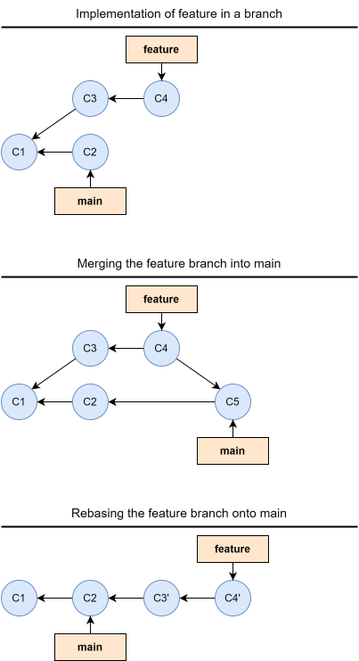
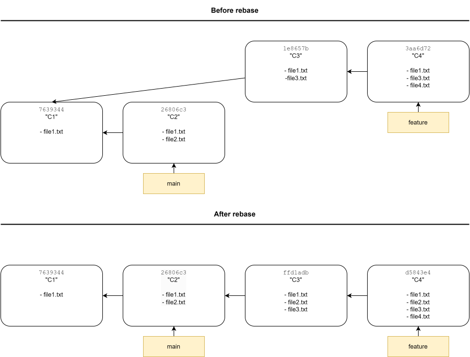
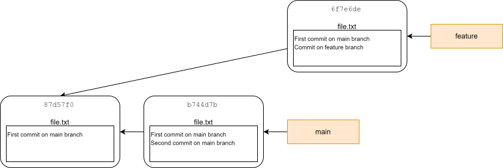
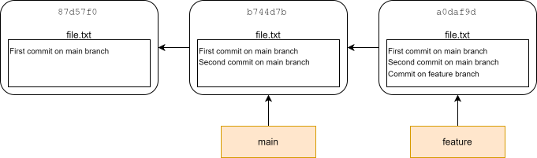
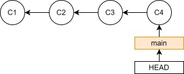
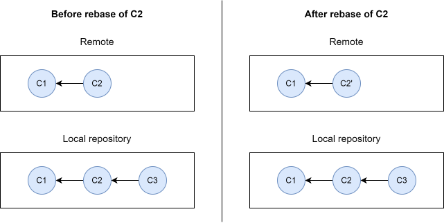

# Rebasing

The commit history of a Git repository is not always pretty. If you commit often you might have a lot of small "WIP", bug fix, typo, and refactor commits. Furthermore, if you use a branching workflow, as introduced in @sec-branching-and-merging (which you definitely should), you might also have a lot of merge commits which makes the commit history even more complicated. Ideally, we would like a simple linear commit history, where each commit is a meaningful change. It is impossible to get everything right in the first try, so what other tools does Git provide to help us with this? This is where rebasing comes into play. Rebasing allows you to rewrite the history of commits in a repository, by reapplying commits on top of another starting point, editing them while you do so. Rebasing has a reputation for being magical hocus pocus that beginners should stay away from, but it is an essential tool to manage a repository, especially when collaborating with others.

<div style="display: grid; grid-template-columns: 60% 40%">
<div style="grid-column: 1">

Let's start by illustrating how rebasing works. Imagine you have a repository with a main branch, from which you make a feature branch with a couple of commits. While working on the feature branch, a commit (C2) is made to the main branch (maybe you switched to the main branch and did the commit, then switched back to the `feature` branch, or maybe someone did the commit on a remote and you pulled the changes into your local clone). When the feature is done, you would normally merge the changes back into the main branch with a merge commit. Using rebasing we could instead replay the commits on the feature branch directly onto the main branch, which would avoid the merge commit altogether, keeping a nice linear commit history. The end result is the same, i.e. the state of the files in C5 and C4' is identical, but the rebased version of the commit history is linear and clean, while the standard method of using a merge commit, creates an unnecessarily complicated commit history. Note that while the state of files in C5 and C4' is the same, the commits are not identical as indicated. They are the results of different commit histories.

Going into a bit more details, the way rebasing work is:

1. The common ancestor of the two branches (the one you are on, and the one you want to rebase onto) is found. In the above example this is C1.

2. Find the patch of changes introduced by each commit on the branch you are on and save them in temporary files. In the above example this is C3 and C4.

3. Reset the current branch to the same commit as the branch you are rebasing onto. In this example this is C2.

4. Apply each patch in the temporary files one at the time. In this example this is the patches from C3 and C4. In the process of applying the patches, their checksum changes: C3 becomes C3' and C4 becomes C4'.

</div>

<div style="grid-column: 2">
  <figure>
    
    <figcaption>Illustration of rebasing</figcaption>
  </figure>
</div>

</div>

After rebasing we can now do a simple fast-forward merge to incorporate the changes from `feature` into `main`.

As noted above, it is important to stress that rebasing changes the commit history. In this example, C3 and C4 was originally applied onto C1, but after the rebase they are applied to C2, which at the very minimum will change the parent commit in the metadata of the commit object, and thus will result in new checksums.


## Example

Now that we have a basic understanding of what rebasing is, let's see how to do it in practice. First, let's set up a repository with a commit history akin to commit history in the illustration above: 

<pre class="terminal">
$ mkdir ~/rebase-example
$ cd ~/rebase-example
$ git init
$ touch file1.txt
$ git add .
$ git commit -m"C1"
$ git switch -c feature
$ touch file3.txt
$ git add .
$ git commit -m"C3"
$ touch file4.txt
$ git add .
$ git commit -m"C4"
$ git switch main
$ touch file2.txt
$ git add .
$ git commit -m"C2"
$ git log --oneline --graph --all
* <span class="col-hash">26806c3 (</span><span class="col-head">HEAD</span> <span class="col-hash">-> </span><span class="col-branch-local">main</span><span class="col-hash">)</span> C2
<span class="col-log-graphline1">|</span> * <span class="col-hash">3aa6d72 (</span><span class="col-branch-local">feature</span><span class="col-hash">)</span> C4
<span class="col-log-graphline1">|</span> * <span class="col-hash">1e8657b</span> C3
<span class="col-log-graphline1">|/</span>
* <span class="col-hash">7639344</span> C1

</pre>

As in the illustration in the start of the chapter, we want to rebase the commits on `feature` onto `main`. To do this we can use the `git rebase` command. Using the form `git rebase <branch>` Git will rebase the active branch (the branch HEAD is pointing to) onto `<branch>`:

<pre class="terminal">
$ git switch feature
$ git rebase main
</pre>

In this simple example, Git will successfully rebase the commits on `feature` onto `main` without any additional input. Let's look at the commit history after the rebase:

<pre class="terminal">
git log --oneline --graph --all
* <span class="col-hash">d5843e4 (</span><span class="col-head">HEAD</span> <span class="col-hash">-></span> <span class="col-branch-local">feature</span><span class="col-hash">)</span> C4
* <span class="col-hash">ffd1adb</span> C3
* <span class="col-hash">26806c3 (</span><span class="col-branch-local">main</span><span class="col-hash">)</span> C2
* <span class="col-hash">7639344</span> C1
</pre>

As expected we can see that the commit ID of the C3 and C4 commit has changed, while the commit ID of C1 and C2 has stayed the same.


<div style="width:100%;margin:auto">

</div>


## Interactive rebasing

So far we have talked about (standard) Git rebasing. As you have seen, rebasing can be used to replay commits from one branch onto another branch. But rebasing is way more flexible than than just doing that. Using the `-i` flag, we can do interactive rebasing, which gives us more options. For example, we can split or combine commits while rebasing. Let see how this look like in practice. Imagine that we have implemented a feature in a series of commits in a feature branch that we want to merge into the main branch:

<pre class="terminal">
$ mkdir ~/rebase-squash
$ cd ~/rebase-squash
$ git init
$ echo "README" > README.txt
$ git add .
$ git commit -m"Initial commit"
$ git switch -c add-new-feature
$ echo "Implementation of feature" > file.txt
$ git add .
$ git commit -m"First draft of implementation"
$ echo "Fix a bug" >> file.txt
$ git commit -am"Fix bug"
$ echo "Refactor code" >> file.txt
$ git commit -am"Refactor to make more effecient"
$ git log --oneline
<span class="col-hash">321b893 (</span><span class="col-head">HEAD</span> <span class="col-hash">-></span> <span class="col-branch-local">add-new-feature</span><span class="col-hash">)</span> Refactor to make more efficient
<span class="col-hash">83f522f</span> Fix bug
<span class="col-hash">86adade</span> First draft of implementation
<span class="col-hash">dc71be8 (</span><span class="col-branch-local">main</span><span class="col-hash">)</span> Initial commit
</pre>

We could simply do a fast-forward merge to integrate the changes from `feature` into `main`, but as is almost always the case, the individual commits on the feature branch are not that interesting in themselves, and are a product of trial and error while developing the feature. In a perfect world we would have been able to implement the entire feature in a single commit without having to fix any bugs or inefficient code. We can rewrite the history of the development of the feature by squashing the three commits on the feature branch into a single commit using interactive rebasing:

<pre class="terminal">
$ git rebase -i main
</pre>

This command opens a file in your file editor that looks like this:

```{=html}
<div class="notepad-file">
<div class="notepad-header">git-rebase-todo</div>
<div class="notepad-body">
<pre>
pick 86adade # First draft of implementation
pick 83f522f # Fix bug
pick 321b893 # Refactor to make more efficient
# Rebase dc71be8..321b893 onto dc71be8 (3 commands)
#
# Commands:
# p, pick &lt;commit&gt; = use commit
# r, reword &lt;commit&gt; = use commit, but edit the commit message
# e, edit &lt;commit&gt; = use commit, but stop for amending
# s, squash &lt;commit&gt; = use commit, but meld into previous commit
# f, fixup [-C | -c] &lt;commit&gt; = like "squash" but keep only the previous
#                    commit's log message, unless -C is used, in which case
#                    keep only this commit's message; -c is same as -C but
#                    opens the editor
# x, exec &lt;command&gt; = run command (the rest of the line) using shell
# b, break = stop here (continue rebase later with 'git rebase --continue')
# d, drop &lt;commit&gt; = remove commit
# l, label &lt;label&gt; = label current HEAD with a name
# t, reset &lt;label&gt; = reset HEAD to a label
# m, merge [-C &lt;commit&gt; | -c &lt;commit&gt;] &lt;label&gt; [# &lt;oneline&gt;]
#         create a merge commit using the original merge commit's
#         message (or the oneline, if no original merge commit was
#         specified); use -c &lt;commit&gt; to reword the commit message
# u, update-ref &lt;ref&gt; = track a placeholder for the &lt;ref&gt; to be updated
#                       to this position in the new commits. The &lt;ref&gt; is
#                       updated at the end of the rebase
#
# These lines can be re-ordered; they are executed from top to bottom.
#
# If you remove a line here THAT COMMIT WILL BE LOST.
#
# However, if you remove everything, the rebase will be aborted.
#
</pre>
</div>
</div>
```

The file starts by listing the commits that are to be rebased and in what order they will be applied to the main branch. As stated near the bottom of the file, we can actually reorder the commits to replay them in a different order. Furthermore, we are informed of different actions we can do while applying each commit. By default, the "pick" option is chosen, which will simply apply the patch of changes in the commit. The option we are looking for here is the "squash" option, which will meld a commit into the previous commit. So to combine the three commits into a single commit we can edit the file to look like this:

```{=html}
<div class="notepad-file">
<div class="notepad-header">git-rebase-todo</div>
<div class="notepad-body">
<pre>
pick 86adade # First draft of implementation
squash 83f522f # Fix bug
squash 321b893 # Refactor to make more efficient
</pre>
</div>
</div>
```

We have removed the comments here to reduce the size of the output, but you don't have to do that. We save and close the file, and another file will open, giving us a chance we alter the commit message:

```{=html}
<div class="notepad-file">
<div class="notepad-header">COMMIT_EDITMSG</div>
<div class="notepad-body">
<pre>
# This is a combination of 3 commits.
# This is the 1st commit message:

First draft of implementation

# This is the commit message #2:

Fix bug

# This is the commit message #3:

Refactor to make more efficient

# Please enter the commit message for your changes. Lines starting
# with '#' will be ignored, and an empty message aborts the commit.
#
# Date:      Thu Aug 13 14:38:20 2026 +0200
#
# interactive rebase in progress; onto dc71be8
# Last commands done (3 commands done):
#    squash 83f522f # Fix bug
#    squash 321b893 # Refactor to make more efficient
# No commands remaining.
# You are currently rebasing branch 'add-new-feature' on 'dc71be8'.
#
# Changes to be committed:
#       new file:   file.txt
#
</pre>
</div>
</div>
```

By default the commit message is a concatenation of the individual commit messages, and we can use that as a starting point to draft a more appropriate commit message:

```{=html}
<div class="notepad-file">
<div class="notepad-header">COMMIT_EDITMSG</div>
<div class="notepad-body">
<pre>
Implement feature
</pre>
</div>
</div>
```

Again, we save and close the file. Git now does the rebasing, and we are done. Let's look at the commit history again:

<pre class="terminal">
$ git log --oneline
<span class="col-hash">3df4aa8 (</span><span class="col-head">HEAD</span> <span class="col-hash">-></span> <span class="col-branch-local">add-new-feature</span><span class="col-hash">)</span> Implement feature
<span class="col-hash">dc71be8 (</span><span class="col-branch-local">main</span><span class="col-hash">)</span> Initial commit
</pre>

We have now rewritten the history of commits, so that it looks like we implemented the feature perfectly in a single commit, and we can do a simple fast-forward merge to integrate the changes into the main branch.

As you might be able to grasp at this point, you can rewrite your commit history entirely as you see fit. Replaying commits from one branch to another, and squashing commits are some of the most common uses of rebasing, but this is, as always, only scraping the surface of what you can do with rebasing.


## Handling merge conflicts while rebasing

So far we have only considered trivial examples where we have no merge conflicts. If there is a merge conflict during rebasing, `git rebase` will stop at the time of the first conflict, add conflict markers to the files with conflicting changes, and give control back to the user to resolve the conflict, before moving forward with the rebase. During this process, Git will provide details on what to do and how, but generally speaking you resolve the conflict by editing files, use `git add` to mark the conflicts as resolved, and then use `git rebase --continue` to continue the rebasing process. During a rebase it is also possible to abort the process and return to the state of the repository before starting the rebase using `git rebase --abort`. Let's illustrate a merge conflict during a rebase with an example. Consider the following repository:

<div style="width:100%;margin:auto">

</div>

Which can be created with the following commmands:

<pre class="terminal">
$ mkdir ~/rebase-merge-conflict
$ cd rebase-merge-conflict
$ git init
$ echo "First commit on main branch" > file.txt
$ git add .
$ git commit -m"First commit on main branch"
$ git switch -c feature
$ echo "Commit on feature branch" >> file.txt
$ git commit -am"Commit on feature branch"
$ git switch main
$ echo "Second commit on main branch" >> file.txt
$ git commit -am"Second commit on main branch"
$ git log --oneline --all --graph
* <span class="col-hash">b744d7b (</span><span class="col-head">HEAD</span> <span class="col-hash">-></span> <span class="col-branch-local">main</span><span class="col-hash">)</span> Second commit on main branch
<span class="col-log-graphline1">|</span> * <span class="col-hash">6f7e6de (</span><span class="col-branch-local">feature</span><span class="col-hash">)</span> Commit on feature branch
<span class="col-log-graphline1">|/</span>
* <span class="col-hash">87d57f0</span> First commit on main branch
</pre>

We want to rebase the `feature` branch onto the `main` branch, but when we try to do this we get the following feedback from Git:

<pre class="terminal">
$ git switch feature
$ git rebase main
Auto-merging file.txt
CONFLICT (content): Merge conflict in file.txt
error: could not apply 6f7e6de... Commit on feature branch
<span class="col-hash">hint: Resolve all conflicts manually, mark them as resolved with</span>
<span class="col-hash">hint: "git add/rm <conflicted_files>", then run "git rebase --continue".</span>
<span class="col-hash">hint: You can instead skip this commit: run "git rebase --skip".</span>
<span class="col-hash">hint: To abort and get back to the state before "git rebase", run "git rebase --abort".</span>
<span class="col-hash">hint: Disable this message with "git config set advice.mergeConflict false"</span>
Could not apply 6f7e6de... # Commit on feature branch

</pre>

Git helpfully informs us that we have a merge conflict in file.txt. Normally, you would open file.txt in a text editor and resolve the conflict, but here we will just remake the file in the terminal, including the changes from both branches:

<pre class="terminal">
$ cat file.txt
First commit on main branch
<<<<<<< HEAD
Second commit on main branch
<span>=======</span>
Commit on feature branch
<span>>>>>>>> 6f7e6de (Commit on feature branch)</span>
$ echo "First commit on main branch" > file.txt
$ echo "Second commit on main branch" >> file.txt
$ echo "Commit on feature branch" >> file.txt
$ cat file.txt
First commit on main branch
Second commit on main branch
Commit on feature branch
</pre>

We can now use `git add` and continue the rebase with `git rebase --continue` as instructed:

<pre class="terminal">
$ git add .
$ git rebase --continue
</pre>

This will finalize the rebase, and Git opens a file for us to edit the commit message for the rebased commit, which we simply keep as "Commit on feature branch". The commit history now looks as following:

<pre class="terminal">
git log --oneline --graph --oneline
* <span class="col-hash">a0daf9d </span>(<span class="col-head">HEAD</span> <span class="col-hash">-></span> <span class="active-branch">feature</span><span class="col-hash">)</span> Commit on feature branch
* <span class="col-hash">b744d7b (</span><span class="col-branch-local">main</span><span class="col-hash">)</span> Second commit on main branch
* <span class="col-hash">87d57f0</span> First commit on main branch
</pre>

Which is also illustrated in the diagram below:

<div style="width:100%;margin:auto">

</div>

We end this example with cleaning up:

<pre class="terminal">
$ cd
$ rm rebase-merge-conflict -rf
</pre>


## Rebasing commits on a branch onto itself

So far we have focused on rebasing commits from the active branch, pointed to by HEAD, onto another branch. But `git rebase` is a lot more flexible than this, which we will explore a little bit here to show how to rebase commits on a branch onto the branch itself. As has been explained earlier in the tutorial, a branch is literally just a pointer to a commit, and `git rebase` allows us to specify commit ID's instead of branch names. Imagine we have a commit history as outlined below:



If we run the command `git rebase <commit ID>` using the commit ID for the C1 commit, the following will happen:

1. Git will find the common ancestor to HEAD and the C1 commit, which is the C1 commit..

2. Git replays C2, C3, and C4, onto C1.

So we can use the same form of `git rebase` to rebase commits on the active branch. Let's illustrate this with an example. Let's first set up a repository with 4 commits as illustrated above:

<pre class="terminal">
$ mkdir rebase-branch-onto-self
$ cd rebase-branch-onto-self
$ git init
$ echo "First commit" > file.txt
$ git add .
$ git commit -m"C1"
$ echo "Second commit" >> file.txt
$ git commit -am"C2"
$ echo "Third commit" >> file.txt
$ git commit -am"C3"
$ echo "Fourth commit" >> file.txt
$ git commit -am"C4"
$ git log --oneline
553f5f8 (HEAD -> main) C4
a889fc6 C3
fecaef5 C2
1c94325 C1
$ cat file.txt
First commit
Second commit
Third commit
Fourth commit
</pre>

Imagine we want to squash C2 and C3 into a single commit. We could do this by interactively rebasing C2, C3, and C4 onto C1, squashing C2 and C3 in the process:

<pre class="terminal">
$ git rebase -i 1c94325
</pre>

This will open the git-rebase-todo file which we edit to look like this:

```{=html}
<div class="notepad-file">
<div class="notepad-header">git-rebase-todo</div>
<div class="notepad-body">
<pre>
pick fecaef5 # C2
squash a889fc6 # C3
pick 553f5f8 # C4
</pre>
</div>
</div>
```

Next Git will prompt us to make a commit message, which we set to "C2 and C3". If we look at the commit history, now it looks like this:

<pre class="terminal">
$ git log --oneline
fa7b717 (HEAD -> main) C4
ec510fc C2 and C3
1c94325 C1
$ cat file.txt
First commit
Second commit
Third commit
Fourth commit
</pre>

Again, notice that the C1 commit ID is the same before, but that the commit ID for C4 has changed, since the history after C1 has be altered.


## When not to rebase

Rebasing is not always a good idea. When collaborating on a project with others, rebasing commits that other people base their work will result in a lot of confusion and irritation for everyone involved. Imagine a repository with two commits in the remote repository used as a central repository for the project. You make a local clone of this repository, and add a commit of your own. Now imagine a collaborator notices that the commit message in C2 was not ideal and runs `git commit --amend` to update it in their local clone and then uses `git push -f` to force-push the changes to the central repository, rewriting the history of commits there as well. Suddenly there is a mismatch between the history in the remote and your local repository. If you try to to push your own local changes now, Git won't allow it, since your local history suddenly does not match the history of the central repository: the C2 commit has been replaced with C2'. It is possible to recover from situations like this, but in general these type of situations will create a lot of frustration and can result in very confusing commit histories. We will not go into more details on how to recover from situations like this in this tutorial^[See "The Perils of Rebasing" in [https://git-scm.com/book/en/v2/Git-Branching-Rebasing](https://git-scm.com/book/en/v2/Git-Branching-Rebasing) for a more detailed example and how to recover.], but will instead give the following advice: <b>do not rebase commits that other people may have based work on</b>.

<div style="width:100%;margin:auto">



</div>

## Should I merge or rebase?

So what is best, merging or rebasing? Neither is objectively better than the other, it all depends on context. Merging is never wrong, but it can lead to commit histories full of intermediate messy commits that holds no value on their own, and merge commits makes commit histories harder to understand. Some people have the opinion that it is important to not alter the history; to preserve an exact record of what has happened. Other people favour altering the history of a repository to make sure that the commit history is linear and each commit is meaningful. Rebasing should always be done carefully. As a general rule, you should only rebase commits that does not live outside of your local clone of a project, or in branches that no other people work on. If you ever have to `git push -f` you are probably doing something you will regret and/or your collaborators will hate you for!

The opinion of this tutorial is that preserving the true commit history of a repository is irrelevant. It is better to prioritise a clean linear commit history, by rebasing local commits before pushing them to a remote. On the other hand you should never rebase commits that others are potentially basing their work on, i.e. rebasing commits that are already on a remote, is often a recipe for disaster.


## Exercises

### Exercise 1 - Squashing all commits

Use the following commands to set up a repository with 3 commits on the `main` branch:

<pre class="terminal">
$ mkdir ~/ex-rebase-squash
$ cd ~/ex-rebase-squash
$ git init
$ echo "Content of first commit" > file.txt
$ git add .
$ git commit -m"First commit"
$ echo "Content second commit" >> file.txt
$ git commit -am"Second commit"
$ echo "Content of third commit2 >> file.txt
$ git commit -am"Third commit"
</pre>

<b>Step 1 - Show commit log and content of file.txt</b>

Print the commit log and content of file.txt in the terminal.

::: {.callout-tip title="Hint" collapse="true" icon="false"}

Use `git log` with appropriate flags to print the commit log, and use `cat` to print the content of file.txt

:::

::: {.callout-note title="Solution" collapse="true" icon="false"}

<pre class="terminal">
$ git log --oneline
<span class="col-hash">6882f38 (</span><span class="col-head">HEAD</span> <span class="col-hash">-></span> <span class="col-branch-local">main</span><span class="col-hash">)</span> Third commit
<span class="col-hash">c06bb27</span> Second commit
<span class="col-hash">ad2c6c5</span> First commit
$ cat file.txt
Content of first commit
Content of second commit
Content of third commit
</pre>

:::

<b>Step 2 - Squash all commits</b>

Rebase all the commits on `main` into a single commit. Note, that using the command `git rebase -i ad2c6c5` will not work, since this would not rebase all the commit on `main`, only the second and third commit (onto the first commit). If you use this approach and try to use the squash option on the second commit (the first line in the git-rebase-todo file) to meld it into the first commit, Git will tell you that you can not do that. You will need to look at the documentation for a flag that can help with rebasing the **root** commit on a branch.

::: {.callout-tip title="Hint" collapse="true" icon="false"}

Use `git rebase --help` to find documentation on the `git rebase` command. Look for documentation on the `--root` flag. 

:::

::: {.callout-note title="Solution" collapse="true" icon="false"}
Run the following command to interactively rebase all the commits, including the root commit, on the `main` branch:

<pre class="terminal">
$ git rebase -i --root
</pre>

Edit the git-rebase-todo file to meld the second and third commit into the first:

```{=html}
<div class="notepad-file">
<div class="notepad-header">git-rebase-todo</div>
<div class="notepad-body">
<pre>
pick ad2c6c5 # First commit
squash c06bb27 # Second commit
squash 6882f38 # Third commit
</pre>
</div>
</div>
```

Afterwards, choose an appropriate new commit message.

:::

<b>Step 3 - Show commit log and content of file.txt</b>

Print the new commit log and check that file.txt still has the same content. Also, look at the new commit ID. Is it the same as any of the commit ID's prior to the rebase? Why?

::: {.callout-note title="Solution" collapse="true" icon="false"}

<pre class="terminal">
$ git log --oneline
<span class="col-hash">b082fad (</span><span class="col-head">HEAD</span> <span class="col-hash">-></span> <span class="col-branch-local">main</span><span class="col-hash">)</span> Squashed commit
$ cat file.txt
Content of first commit
Content of second commit
Content of third commit
</pre>

The commit ID of the squashed commit is different than any of the commit ID's from before the rebase. This is because the history has been altered. The content of the file is now a product of a single commit, not a series of three commits.

:::


### Exercise 2 - Resolve multiple merge conflicts during rebase

Create the following repository where a README and some base code for a project is created and edited on the `main` branch, while at the same time, a feature is being implemented in the `implement-feature` branch:

<pre class="terminal">
$ mkdir ~/ex-rebase-merge-conflicts
$ cd ~/ex-rebase-merge-conflictts
$ git init
$ echo "Some base code for project" > basecode.txt
$ echo "Project README" > README.txt
$ git add .
$ git commit -m"Initial commit"
$ git switch -c implement-feature
$ echo "Implementation of feature" > feature.txt
$ echo "New code needed to implement feature" >> basecode.txt
$ git add .
$ git commit -m"Implement feature"
$ echo "This project now includes this awesome feature" >> README.txt
$ git commit -am"Add info on feature in README"
$ git switch main
$ echo "Updated base code for project" > basecode.txt
$ echo "Updated project README" > README.txt
$ git commit -am"Update base code and README"
</pre>

The goal of this exercise is to rebase `implement-feature` onto main, squashing the two commits in the process, while handling merge conflicts.

<b>Step 1 - Get an overview of the commit log</b>

Print the commit log of the repository to get an overview of the history of the project. Make sure to include the commits on all branches, summarize the content of each commit in one line, and add a graphical representation of the commit history

::: {.callout-tip title="Hint" collapse="true" icon="false"}

If you have followed the instructions above you are currently on the `main` branch. If you run `git log` you will only see commits that are reachable by following the parent commits from the tip of the `main` branch, i.e. you will not see the commits on the feature branch. You need to use a flag to ensure that parent commits from the tip of **all** branches are included. Use `git log --help` to find documentation on how to use `git log`, and also look for flags that can summarize the content of each commit to **oneline** and add a **graph**ical representation of the commit history.

:::

::: {.callout-tip title="Solution" collapse="true" icon="false"}

<pre class="terminal">
$ git log --all --graph --oneline
* <span class="col-hash">cb32850 (</span><span class="col-head">HEAD </span><span class="col-hash">-></span> <span class="col-branch-local">main</span><span class="col-hash">)</span> Update base code and README
<span class="col-log-graphline1">|</span> * <span class="col-hash">03baf98 (</span><span class="col-branch-local">implement-feature</span><span class="col-hash">)</span> Add info on feature in README
<span class="col-log-graphline1">|</span> * <span class="col-hash">2cbc9bf</span> Implement feature
<span class="col-log-graphline1">|/</span>
* <span class="col-hash">3bb821e</span> Initial commit
</pre>

:::

<b>Step 2 - Initiate rebase</b>

Initiate an interactive rebase of `implement-feature` onto `main` squashing the two commits on `implement-feature` in the process. Do not attempt to complete the rebase at this point; you will handle the merge conflict in the next step.

::: {.callout-tip title="Hint" collapse="true" icon="false"}

If you followed the above steps to create the repository, the active branch is `main`. You need to switch to `implement-feature` before starting the rebase.

:::

::: {.callout-note title="Solution" collapse="true" icon="false"}

Run the followig commands to initiaze the rebase:

<pre class="terminal">
$ git switch implement-feature
$ git rebase -i main
</pre>

Git will open a file in a file editor, prompting you how to handle each commit in the rebase. Edit the file to meld the second commit into the first:

```{=html}
<div class="notepad-file">
<div class="notepad-header">git-rebase-todo</div>
<div class="notepad-body">
<pre>
pick 2cbc9bf # Implement feature
squash 03baf98 # Add info on feature in README
</pre>
</div>
</div>
```

:::

<b>Step 3 - resolve first merge conflict during rebase</b>

After initiating the rebase, Git first attempts to reapply the patch of changes from `2cbc9bf` onto `cb32850`. While during so a merge conflict arises in codebase.txt, and you are prompted to resolve this conflict before the rebase can continue.

1) Why is there a merge conflict in codebase.txt?

::: {.callout-note title="Solution" collapse="true" icon="false"}

On the tip of the `main` branch, in the commit `cb32850` (onto which we are rebasing), the content of codebase.txt is the line "Updated base code for project". The `implement-feature` branch branched off from `main` at the previous commit `3bb821e`, where the content of codebase.txt was the line "Some base code for project".
The patch of changes from `2cbc9bf` is basically saying "Append the line 'New code needed to implement feature' to codebase.txt which contains the line 'Some base code for project'. But this does not correspond with the actual content of codebase.txt in `cb32850` which is "Updated base code for project", which causes the merge conflict.

:::

2) Edit the content of codebase.txt to remove the added conflict markers and resolve the conflict: keep the line "Updated base code for project" from the `main` branch version of codebase.txt, and the "New code needed to implement feature" from the `implement-feature` branch.

::: {.callout-note title="Solution" collapse="true" icon="false"}

Open, edit, and save, the file in your favorite file editor. Here we show how to edit the file by recreating it using shell commands:

<pre class="terminal">
$ cat basecode.txt
<<<<<<< HEAD
Updated base code for project
<span>=======</span>
Some base code for project
New code needed to implement feature
<span>>>>>>>> 2cbc9bf (Implement feature)</span>
$ echo "Updated base code for project" > codebase.txt
$ echo "New code needed to implement feature" >> codebase.txt
$ cat codebase.txt
Updated base code for project
New code needed to implement feature
</pre>

:::

3) Mark the conflict as resolved and continue the rebase. When prompted to update the commit message, just keep it as is. Do not proceed with resolving the second merge conflict just yet.

::: {.callout-tip title="Hint" collapse="true" icon="false"}

Follow the instructions provided by Git in the terminal

:::

::: {.callout-note title="Solution" collapse="true" icon="false"}

<pre class="terminal">
$ git add .
$ git rebase --continue
</pre>

:::


<b>Step 4 - resolve the second merge conflict during rebase</b>

After resolving the first merge conflict and continuing the rebase, Git has now applied the first commit on `implement-feature` (`2cbc9bf`) onto `cb32850`, and now tries to apply the patch of changes from the second commit (`03baf98`), squashing the changes into the previous commit. While doing so, another merge conflict arises in README.txt. Resolve the merge conflict, and finalize the rebase:

1) Why is there a merge conflict in README.txt?

::: {.callout-note title="Solution" collapse="true" icon="false"}

The reason for the conflict is analogous to why we had a merge conflict in codebase.txt: The patch of changes we are trying to apply states that the content of the first line of README.txt is "Project README", but the content of the first line of README.txt in the commit onto which we are trying to apply the changes is "Updated project README". This conflicting information needs to be resolved.

:::

2) Edit the content of README.txt to remove the added conflict markers and resolve the conflict: keep the line "Updated project README" from the `main` branch version of README.txt, and the "This project now includes this awesome feature" from the `implement-feature` branch.

::: {.callout-note title="Solution" collapse="true" icon="false"}

Open, edit, and save, the file in your favorite file editor. Here we show how to edit the file by recreating it using shell commands:

<pre class="terminal">
$ cat README.txt
<<<<<<< HEAD
Updated project README
<span>=======</span>
Project README
This project now includes this awesome feature
<span>>>>>>>> 03baf98 (Add info on feature in README)</span>
$ echo "Updated project README" > README.txt
$ echo "This project now includes this awesome feature" >> README.txt
$ cat README.txt
Updated project README
This project now includes this awesome feature
</pre>

:::

3) Mark the conflict as resolved and continue the rebase. When prompted to update the commit message, edit it something more appropriate e.g. "Implement feature".

::: {.callout-tip title="Hint" collapse="true" icon="false"}

Follow the instructions provided by Git in the terminal

:::

::: {.callout-note title="Solution" collapse="true" icon="false"}

<pre class="terminal">
$ git add .
$ git rebase --continue
</pre>

:::

<b>Step 5 - Print commit log</b>

Print the commit log again to see how the rebase history of commits looks like after the rebase. Explain why some commit ID's are the same, and why others have changed.

::: {.callout-note title="Solution" collapse="true" icon="false"}

<pre class="terminal">
$ git log --oneline --graph --all
* <span class="col-hash">603e19f (</span><span class="col-head">HEAD</span> <span class="col-hash">-></span> <span class="col-branch-local">implement-feature</span><span class="col-hash">)</span> Implement feature
* <span class="col-hash">cb32850 (</span><span class="col-branch-local">main</span><span class="col-hash">)</span> Update base code and README
* <span class="col-hash">3bb821e</span> Initial commit
</pre>

We rebased `implement-feature` onto the `main` branch, so the two commit on the `main` branch, `3bb821e` and `cb32850` are unchanged. The two commits on the `implement-feature` branch have been replayed onto `main` and have also been squashed, both resulting in the new combined commit having a new commit ID, `603e19f`.

::::

We have now rebased (and cleaned) the commits on `implement-feature` onto `main` and can incorporate the changes into `main` with a simple fast-forward merge. We end the exercise by cleaning up:

<pre class="terminal">
$ cd
$ rm ex-rebase-merge-conflicts -rf
</pre>


### Exercise 3 - Reorder commits

Run the following commands to create a repository with two commits on `main`:

<pre class="terminal">
$ mkdir ex-rebase-reorder
$ cd ex-rebase-reorder
$ git init
$ echo "Implementation of feature" > feature.txt
$ git add .
$ git commit -m"Add feature"
$ echo "Project README" > README.txt
$ git add .
$ git commit -m"Add README"
$ git log --oneline
<span class="col-hash">b93c2a0 (</span><span class="col-head">HEAD</span> <span class="col-hash">-></span> <span class="col-branch-local">main</span><span class="col-hash">)</span> Add README
<span class="col-hash">5e8e19d</span> Add feature
</pre>

In our eagerness to start the project we jumped directly into implementing a feature, and then subsequently remembered to add a README to the project. Rewrite the history of the project, so that the README is added as the first commit and then the feature is implemented in the second commit.

<b>Step 1 - Reorder the commits</b>

Use interactive rebasing to reorder the commits on `main`.

::: {.callout-tip title="Hint 2" collapse="true" icon="false"}

You need to rebase the all the commits on `main`, including the root commit. See exercise 1, on for help on how to do this.

:::

::: {.callout-note title="Solution" collapse="true" icon="false"}

Run the following command to rebase all the commits on `main` including the root commit:

<pre class="terminal">
$ git rebase -i --root
</pre>

In the git-rebase-todo file that is opened, reorder the commits, to apply the second commit `b93c2a0` first:

```{=html}
<div class="notepad-file">
<div class="notepad-header">git-rebase-todo</div>
<div class="notepad-body">
<pre>
pick b93c2a0 # Add README
pick 5e8e19d # Add feature
</pre>
</div>
</div>
```

:::


<b>Step 2 - Print the commit log</b>

Print the commit log. Have the commit ID's changed? Why?

::: {.callout-note title="Solution" collapse="true" icon="false"}

<pre class="terminal">
$ git log --oneline
<span class="col-hash">50f0523 (</span><span class="col-head">HEAD</span> <span class="col-hash">-></span> <span class="col-branch-local">main</span><span class="col-hash">)</span> Add feature
<span class="col-hash">0bdde57</span> Add README
</pre>

The commit ID for both commits have changed. This is because we have rewritten the history. The patch of changes implementing the feature is now done first, in the empty repository, not on top of the repository where the README already exists. Likewise, the patch of changes adding the README is now done on top of the commit that has already added the feature, also changing the commit ID.

:::

Clean up:

<pre class="terminal">
$ cd
$ rm ~/ex-rebase-reorder -rf
</pre>


### Exercise 4 - Splitting a commit

Run the following commands to create a repository with two commits adding both a README and two features:

<pre class="terminal">
$ mkdir ~/ex-rebase-split
$ cd ~/ex-rebase-split
$ git init
$ touch README.txt
$ git add .
$ git commit -m"Initial commit"
$ touch feature1.txt
$ touch feature2.txt
$ git add .
$ git commit -m"Add feature1 and feature2"
$ git log --oneline
<span class="col-hash">d7c6a64 (</span><span class="col-head">HEAD</span> <span class="col-hash">-></span> <span class="col-branch-local">main</span><span class="col-hash">)</span> Add feature1 and feature2
<span class="col-hash">06b1273</span> Initial commit
</pre>

We decide that adding both features in the same commit is not ideal, and we want to split the commit into two, one for each implementation of a feature. The question is how, which we will explore here.

<b>Step 1 - Search the documentation</b>

Look at the documentation for `git rebase`, and find a section explaining how to split commits during an interactive rebase.

::: {.callout-note title="Solution" collapse="true" icon="false"}

Use `git rebase --help` to pull up documentation for `git rebase`, and find the section concerning splitting commits. You can also find the documentation here [https://git-scm.com/docs/git-rebase#_splitting_commits](https://git-scm.com/docs/git-rebase#_splitting_commits).

:::

<b>Step 2 - Split the commit</b>

Use the information provided in the documentation to split the `d7c6a64` commit.


::: {.callout-note title="Solution" collapse="true" icon="false"}

As explained in the documentation we can run the following command to rebase the `d7c6a64` commit:

<pre class="terminal">
$ git rebase -i d7c6a64^
</pre>

We then modify the git-rebase-todo file to use the "edit" option on the commit:

```{=html}
<div class="notepad-file">
<div class="notepad-header">git-rebase-todo</div>
<div class="notepad-body">
<pre>
edit d7c6a64 # Add feature1 and feature2
</pre>
</div>
</div>
```
Next, we run the following command to move HEAD to the previous commit and unstage feature1.txt feature2.txt:

<pre class="terminal">
$ git reset HEAD^
$ git status
<span style="color:red">interactive rebase in progress; onto</span> 06b1273
Last command done (1 command done):
   edit d7c6a64 # Add feature1 and feature2
No commands remaining.
You are currently editing a commit while rebasing branch 'main' on '06b1273'.
  (use "git commit --amend" to amend the current commit)
  (use "git rebase --continue" once you are satisfied with your changes)

Untracked files:
  (use "git add <file>..." to include in what will be committed)
        <span class="col-status-changed">feature1.txt</span>
        <span class="col-status-changed">feature2.txt</span>
</pre>


This leaves us in a state where feature1.txt and feature2.txt is in the working directory, but they have not been staged yet. We can now add and commit them one at a time to split up the commit into two:

<pre class="terminal">
$ git add feature1.txt
$ git commit -m"Add feature1"
$ git add feature2.txt
$ git commit -m"Add feature2"
</pre>

Finally, we continue the rebase and print the commit log:

<pre class="terminal">
$ git rebase --continue
$ git log --oneline
<span class="col-hash">f81244f (</span><span class="col-head">HEAD</span> <span class="col-hash">-></span> <span class="col-branch-local">main</span><span class="col-hash">)</span> Add feature2.txt
<span class="col-hash">2423455</span> Add feature1
<span class="col-hash">06b1273</span> Initial commit
</pre>
:::


### Exercise 5 - Undoing a rebase

This exercise assumes you have read @sec-git-reflog.

Sometimes things will go wrong when using Git. This is also the case when doing a rebase. Maybe the rebase did not do what you wanted it to do, or maybe the whole rebase process went haywire for unknown reasons. If you realise something is wrong doing the rebase you should be able to use `git rebase --abort` to restore your repository back to the state before you initiated the rebase, but maybe even this might go wrong for whatever reason. A more general approach to recover from a rebase that goes wrong or that you regret, is to use `git reflog` to identify the commit ID HEAD was pointing to before the rebase, and  use `git reset` to move HEAD back to the commit it was pointing to prior to the rebase. Use the following commands to set up a repository with 3 commits:

<pre class="terminal">
$ mkdir ~/ex-rebase-undo
$ cd ~/ex-rebase-undo
$ git init
$ echo "First commit" > file.txt
$ git add .
$ git commit -m"First commit"
$ echo "Second commit" >> file.txt
$ git commit -am"Second commit"
$ echo "Third commit" >> file.txt
$ git commit -am"Third commit"
$ git log --oneline
<span class="col-hash">8993eb8 (</span><span class="col-head">HEAD</span> <span class="col-hash">-></span> <span class="col-branch-local">main</span><span class="col-hash">)</span> Third commit
<span class="col-hash">1dd5e36</span> Second commit
<span class="col-hash">cd2c018</span> First commit
</pre>

<b>Step 1 - Rebase commits</b>

Combine the second and third into a single commit.

::: {.callout-tip title="Hint 2" collapse="true" icon="false"}

Use an interactive rebase to squash the two commits.

:::


::: {.callout-tip title="Hint 1" collapse="true" icon="false"}

Consider how to specify the range of commits to rebase. You need to use use `git rebase -i <commit ID>`, where `<commit ID>` is the commit ID of the commit you want to rebase onto, i.e. the "First commit" commit.

:::


::: {.callout-note title="Solution" collapse="true" icon="false"}

Run the following command:

<pre class="terminal">
$ git rebase -i cd2c018
</pre>

This will rebase all commits on the main branch (the branch HEAD is pointing to) after cd2c018 (the first commit) onto that commit.

In the file that opens in your file editor, edit the second line to squash the third commit into the second commit:


```{=html}
<div class="notepad-file">
<div class="notepad-header">git-rebase-todo</div>
<div class="notepad-body">
<pre>
pick 1dd5e36 # Second commit
squash 8993eb8 # Third commit
</pre>
</div>
</div>
```

Finally, edit the commit message in the next file that is opened:

```{=html}
<div class="notepad-file">
<div class="notepad-header">COMMIT_EDITMSG</div>
<div class="notepad-body">
<pre>
Second and third commit
</pre>
</div>
</div>
```

<pre class="terminal">
$ git log --oneline
947a6fc (HEAD -> main) Second and third commit
cd2c018 First commit
</pre>

:::


<b>Step 2 - Regret!</b>

Regret this decision immediately. Use `git reflog` to identify the commit ID of the old "Third commit" commit, and use `git reset` to move the HEAD pointer to restore the repository back to the state before the rebase.

::: {.callout-note title="Solution" collapse="true" icon="false"}

<pre class="terminal">
947a6fc (HEAD -> main) HEAD@{0}: rebase (finish): returning to refs/heads/main
947a6fc (HEAD -> main) HEAD@{1}: rebase (squash): Second and third commit
1dd5e36 HEAD@{2}: rebase (start): checkout cd2c018
8993eb8 HEAD@{3}: commit: Third commit
1dd5e36 HEAD@{4}: commit: Second commit
cd2c018 HEAD@{5}: commit (initial): First commit
</pre>

We can see from the log that the old "Third commit" ID is 8993eb8. We can now use `git reset --hard` to restore the repository to the state before the rebase:

<pre class="terminal">
$ git reset --hard 8993eb8
$ git log --oneline
8993eb8 (HEAD -> main) Third commit
1dd5e36 Second commit
cd2c018 First commit
</pre>

:::