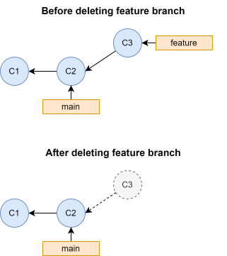

# Recovering deleted commits {#sec-git-reflog}

When using Git, you will inevitable end up in a situation where you accidentally "delete" one or more commits, for example by deleting a branch before integrating the changes into the main code. The good news is, that the "deleted" commits are almost never truly gone, and they can be recovered. In this chapter we will introduce the reference log, also called reflog, which we can use to recover lost commits.

## When does Git actually delete an object?

If you delete a branch with commits that have not been integrated into the main code, the only thing you have done is deleting the reference to a specific commit, i.e. the pointer to the tip of a series of commits. The commit objects are still in the Git database, but they are now unreachable: they are not ancestors of any commits that are on a branch. From time to time Git *will* delete unnecessary (unreachable) commits and optimize the repository when it deems it necessary, but this only happens when you do specific operations or after a long period of time in very large repositories. If you want to recover a lost commit, you can always do this as long as you do so right after accidentally "deleting them".

  <figure>
    
    <figcaption>Unreachable commits on a deleted branch</figcaption>
  </figure>

## Identifying and recovering unreachable commits using the reference log

To recover a lost commit, the first step is to recover the SHA-1 checksum of that commit. Since this commit is now unreachable, we can not use `git log <branch>` to find the SHA-1 checksum, since `git log <branch>` only includes reachable commits from the tip of a branch. But Git has another tool that can help us: the reference log, or just reflog, which has its own command, `git reflog`. The reflog logs all changes to a reference that has happened over time, meaning that every time a reference is changed to point to something else, this is logged. Let's see how this looks like in practice by creating a repository with the same history as illustrated above: a `main` branch with two commits, and a `feature` branch with a single commit off of `main`, where we delete the `feature` branch before integrating the changes into `main`:

<pre class="git-command">
$ mkdir ~/reflog-example
$ cd ~/reflog-example
$ git init
$ echo "Content of C1" > file.txt
$ git add .
$ git commit -m"C1"
$ echo "Content of C2" >> file.txt
$ git commit -am"C2"
$ git switch -c feature
$ echo "Content of C3" >> file.txt
$ git commit -am"C3"
$ git switch main
$ git branch -D feature
$ git log --oneline --all --graph
* 6891983 (HEAD -> main) C2
* a961cba C1
</pre>

After deleting `feature`, we can no longer see the commits on that branch. If we run `git reflog` however, we can recover the branch:

<pre class="git-command">
$ git reflog
6891983 (HEAD -> main) HEAD@{0}: checkout: moving from feature to main
b2d535d HEAD@{1}: commit: C3
6891983 (HEAD -> main) HEAD@{2}: checkout: moving from main to feature
6891983 (HEAD -> main) HEAD@{3}: commit: C2
a961cba HEAD@{4}: commit (initial): C1
</pre>

By default, `git reflog` shows the reference log of HEAD. The format `HEAD @{x}`, means where was HEAD x moves ago. So `HEAD@{0}` means where is HEAD right now, `HEAD@{1}` means where was HEAD one move ago, and so one. From the reflog we can se that one move ago, HEAD was pointing to the C3 commit, the tip of the former `feature` branch, and we can see the SHA1 checksum of that commit is `b2d535d`. Now we can recover the `feature` branch simply by making a new branch pointing to that commit:

<pre class="git-command">
$ git branch feature b2d535d
$ git log --oneline --graph --all
* b2d535d (feature) C3
* 6891983 (HEAD -> main) C2
* a961cba C1
</pre>

## Exercises

### Recover an "undone" commit

In @sec-undoing-changes we showed how we can "undo" a commit using `git reset`. In this exercise you will recover a commit that was accidentially "undone".

Use the following commands to set up a repository with two commits on `main`:

<pre class="git-command">
$ mkdir ~/ex-reflog-recover-undo
$ cd ~/ex-reflog-recover-undo
$ git init
$ echo "Content" > file.txt
$ git add .
$ git commit -m"First commit"
$ echo "More content" >> file.txt
$ git commit -am"Second commit"
</pre>

<b>Step 1 - "Undo" the second commit</b>

Use `git reset` to "undo" the second commit and update the working directory and index to match the content of the first commit.

::: {.callout-note title="Solution" collapse="true" icon="false"}

<pre class="git-command">
$ git reset --hard HEAD^
</pre>

:::

<b>Step 2 - Recover the commit </b>

Print the commit log to check that the second commit is not unreachable. Then use the reference log to identify and recover the second commit using `git reset` again.

::: {.callout-note title="Solution" collapse="true" icon="false"}

<pre class="git-command">
$ git log --oneline --all
d3e3264 (HEAD -> main) First commit
$ git reflog
d3e3264 (HEAD -> main) HEAD@{0}: reset: moving to HEAD^
9071636 HEAD@{1}: commit: Second commit
d3e3264 (HEAD -> main) HEAD@{2}: commit (initial): First commit
$ git reset --hard 9071636
$ git log --oneline
9071636 (HEAD -> main) Second commit
d3e3264 First commit
</pre>

:::
