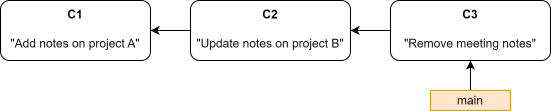
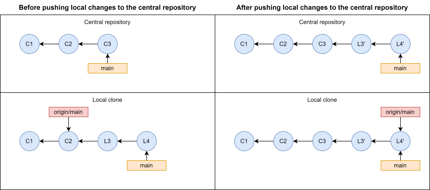
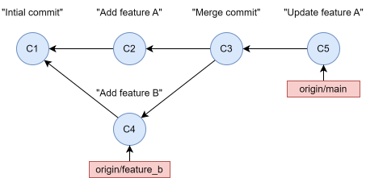

# Git workflows

Git is very flexible, and there is not one standardized approach on how to use it that you are supposed to follow. However, to use Git in a productive manner, it is important to develop or select a Git *workflow* to use, especially if you are collaborating with others. A Git workflow is a guideline on how to use Git, and a workflow should be selected and agreed upon by collaborators, before a project is initiated, so that it is clear to everyone how changes to the project is to be applied. In this chapter we will briefly introduce a couple of workflows and, as an example, explain the workflow that was used to develop this tutorial.

## Considerations when selecting a workflow

When selecting a workflow you should consider several things:

<b>A workflow is a guideline, not a strict set of rules:</b> 
You don't have to adhere strictly to a workflow you have selected. It is perfectly fine to make any kind of modifications you see fit. The only important thing is that your workflow works for you.

<b>Keep it simple:</b> 
Don't select an overcomplicated workflow that you don't need. You might end up in a situation where Git feels like it is hindering, not enhancing, productivity and collaboration. Also, your collaborators will not appreciate having to figure out how to manoeuvre some esoteric workflow that you concocted yourself.

<b>Have a plan for how to fix mistakes:</b> 
Consider how mistakes will be handled in the workflow. For example, if someone mistakenly rebases commits in the central repository, altering commits others are basing their work on, how will this be handled within the selected workflow? Using `git push -f` from another local clone to restore the history of the central repository, public lynching, using a forking workflow to restrict who can push to the central repository, or something else entirely?

<b>How the workflow scales :</b> 
If you know that the size of the team working on the project might increase, consider if the workflow also works in larger collaborations. For example, if you start a project on your own, but you know that collaborators will join the project in the future, you should probably, as a minimum, select a workflow using a remote as central repository.

## The simplest possible workflow

Let's start with simplest possible workflow: working on a project on your own and simply making commits to `main` from time to time. You simply use `git init` to initialize a Git repository, and then use `git add .` and `git commit` when you feel like it. You are not exactly utilizing Git to the fullest using this workflow, but at the same time this is sometimes the most appropriate approach to use. For example, imagine you have a text document where you keep work-related notes, maybe as an alternative to using the Microsoft Sticky Notes app, and you would like to use Git so that you can easily recover old notes that you have deleted because you thought you didn't need them any more. Making a commit on `main` every time you change your notes is probably all you need.

## Centralized workflow

The centralized workflow is a simple workflow using a remote as a central repository. Each developer clones the repository and works on their own local copy of the project, making changes and commits locally on their `main` branch. When a developer wants to integrate their local changes they first fetch from the central repository. If nothing has changed since they started their local work, they can simply push their changes to `main` in the central repository. In case new commits have been on the central repository by others in the meantime, they replay their local commits onto the tip of `main` in the central repository, fixing any merge-conflicts in the process.

## Feature branch workflow

The feature branch workflow also uses a remote as a central repository, and the core idea behind the feature branch workflow is to move development of code away from the main branch and into other branches, so-called feature branches. This makes it easier to develop new features without disturbing the main version of the code. This keeps the main version of the code stable and always working. Pushing the feature branches to the central repository also enables the possibility of collaborators to review and discuss of code before it is integrated into `main`, either by the person who developed the feature or by a collaborator who has been assigned the task to be the only person who commits to `main`. If the central repository lives on a hosting site like GitHub this process is even smoother using pull request and discussion features of such sites. Developing code in a feature branch workflow where each task/feature is clearly defined and developed in a separate branch, will also lead to fewer and less complicated merge conflicts, since changes in each feature branch is less likely to be overlapping with changes made in other feature branches.

## Forking workflow

The forking workflow is fundamentally different from the previously introduced workflows. It is centered around using a Git hosting site, like GitHub, where you can fork a repository, i.e. collaborators can make a server-site clone of the official repository. Instead of cloning the central repository, collaborators make a fork of the official central repository, and clone that repository instead. In their local clone, collaborators develop changes, and then push them to their fork. Afterwards, they file a pull request to the maintainer of the official repository, and the maintainer can then decide if they want to integrate the changes. This workflow is often seen in public open source projects. The maintainer of the project is the only one with write access to the official project, but other people can still contribute to the project using this workflow.

# Example

To give a concrete example of a Git workflow in a project, let's look at the workflow that was used for the codebase used to make this tutorial. When deciding on a workflow the following considerations were made:

- Project developed by a single developer, so no need to worry too much about a structured workflow or rebasing commits.

- Want to be able to access the project from my personal computer.

- Want to host tutorial and slides on GitHub pages. Need a stable branch for this, where every new commit to the branch triggers and automatic update of the static website.

- Want another primary branch where I have a stable, but less polished version of the tutorial that is not quite ready to trigger an update of the tutorial on GitHub pages.

- Want to use a feature branch inspired workflow.

Based on these considerations, it was of course as given that a remote on GitHub should be used as the central repository for project. The `main` branch was chosen to be used to generate the static website on GitHub pages, and another primary branch `dev`, branching off of `main`, was used to have another stable branch, from which feature branches were made. Every time the stable version on `dev` had progressed enough to warrant updating the website, `dev` was integrated into `main`, triggering an automatic update of the website. Using this workflow it would also be easy for others to contribute by using a forking workflow (although this was deemed highly unlikely to happen in practice). Finally, it is expected that this project will receive updates beyond the first final version. In this case, the entire history of the repository might be rewritten as a single commit, since the entire history up until the first version is irrelevant, and it will make the history cleaner going forward.

In practice, the `dev` branch was barely used in practice (at least up until this point), since most of the time it felt appropriate to update the website each time a new feature had been implemented, e.g. a new draft of a chapter was added, revised etc.
